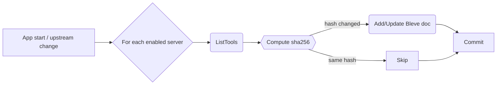

# mcpproxy-go — Design Document (v0.1.0)

## 1  Goals

Re‑implement the existing Python MCP proxy in Go, delivering a single‑binary desktop proxy with concurrent performance, local BM25 search, and a minimal cross‑platform system‑tray UI.

### MVP scope (v0.1)

* **Transport** – downstream Streamable‑HTTP only.
* **Built‑in MCP tools**

  * `retrieve_tools` – BM25 keyword search over all upstream tools.
  * `call_tool` – invoke any upstream tool.
  * `upstream_mcp_servers` – CRUD for upstream registry (`enabled` flag).
  * `tools_stat` – aggregate statistics (total tools, call counts, top‑N).
* **Index lifecycle** – full rebuild at start‑up and whenever an *enabled* upstream is added, removed or updated.
* **Tray UI** – first‑class feature; icon and systray menu only (no full GUI); toggle proxy, manage upstreams, show counters.
* **Local persistence** – defaults to `~/.mcpproxy/`:

  * `config.db` – bbolt key/value store (servers, stats, hashes).
  * `index.bleve/` – Bleve Scorch index (BM25).

## 2  Non‑Goals (v0.1)

* WebSocket/stdin transports, distributed indexing, vector search.

## 3  Tech Stack

| Concern           | Library                           | Reason                             |
| ----------------- | --------------------------------- | ---------------------------------- |
| MCP server/client | **`mark3labs/mcp-go`**            | Native Go, Streamable‑HTTP support |
| Full‑text search  | **Bleve v2**                      | Embeddable BM25                    |
| CLI & config      | **`spf13/cobra` + `spf13/viper`** | Flags → env → file binding         |
| Persistence       | **bbolt**                         | Single‑file ACID                   |
| Sys‑tray          | **`getlantern/systray`**          | Tiny cross‑platform tray           |
| Logging           | **zap** / **slog**                | Structured logs                    |
| Metrics           | `prometheus/client_golang`        | Optional `/metrics`                |

## 4  Architecture Overview

```
┌────────────┐ Streamable‑HTTP ┌──────────────────────────────┐ Streamable‑HTTP ┌──────────────┐
│  Clients   │ ⇆ :8080 ⇆       │        mcpproxy‑go           │ ⇆  Upstream N ⇆ │  MCP Server  │
└────────────┘                 │                              │                 └──────────────┘
                               │  ┌───────────────┐           │
                               │  │ Tray Daemon   │───────────┘
                               │  └───────────────┘
                               │   ↙ Bleve index
                               └──→ bbolt (cfg, stats, hashes)
```

* **Downstream server** – `server.ServeStreamableHTTP`.
* **Upstream map** – persistent `client.Client` per *enabled* server.

  * On *add/enable* → call `ListTools`, compute hashes, rebuild index.
* **Indexer** – rebuilds index; swaps pointer atomically on finish.
* **Stats** – middleware increments per‑tool counters inside Bolt.

## 5  Naming & Hashing Scheme

* **`tool_name`** – canonical identifier used throughout the proxy.

  * Format: `<serverName>:<originalToolName>` (e.g. `prod:compress`).
* **`tool_hash`** – `sha256(serverName + toolName + parametersSchemaJSON)`.

  * Stored alongside tool metadata in both Bleve doc and Bolt `toolhash` bucket.
  * During re‑sync `ListTools` results are hashed; unchanged hashes skip re‑indexing.

## 6  Data Model (bbolt)

| Bucket      | Key           | Value                        |
| ----------- | ------------- | ---------------------------- |
| `upstreams` | `<uuid>`      | `{name,url,enabled,created}` |
| `toolstats` | `<tool_name>` | uint64 call‑count            |
| `toolhash`  | `<tool_name>` | 32‑byte sha256               |
| `meta`      | `schema`      | uint version                 |

## 7  Indexer Flow



* Bleve doc fields: `tool_name`, `server`, `description`, `tags`, `hash`.
* Query path: `retrieve_tools` → `bleve.Search` (MatchQuery) top‑20.

## 8  MCP Tool Specifications

### 8.1  `retrieve_tools`

```jsonc
Input:  {"query":"rate limit"}
Output: {"tools":[{"tool_name":"prod:compress","score":0.81}]}
```

### 8.2  `call_tool`

```jsonc
Input: {
  "name": "prod:compress",  // tool_name
  "args": {"text": "abc"}  // transparently forwarded
}
Output: <raw upstream JSON>
```

The proxy parses `name` to pick the correct upstream client and forwards `args` unchanged.

### 8.3  `upstream_mcp_servers`

```jsonc
Input:  {"operation":"add","url":"https://api.mcp.dev","name":"dev"}
Output: {"id":"uuid","enabled":true}
```

Operations: `list` / `add` / `remove` / `update`.

### 8.4  `tools_stat`

Returns `{total_tools, top:[{tool_name,count}]}`.

## 9  Concurrency & Error Handling

* Bolt writes serialised via a `storage.Manager`.
* Upstream map behind `sync.RWMutex`.
* Index rebuild runs in goroutine; stale index served until swap.
* Panic‑safe wrappers restart crashed upstream clients.

## 10  CLI, Config & Tray

* `mcpproxy [--listen :8080] [--data-dir ~/.mcpproxy] [--upstream "prod=https://api"]`
* Viper reads `$MCPP_` envs and `config.toml`.
* Tray (systray): icon + menu items (Enable, Disable, Add…, Reindex, Quit).

## 11  Build & Packaging

* Cross‑compile via `GOOS=darwin/windows/linux`.
* macOS: bundle into `.app`, sign & notarise; DMG + Homebrew Cask.
* Windows: `-H windowsgui` exe → MSIX/MSI; code‑sign EV cert.
* Icon embedded using `go:embed` + `.syso` for Windows.

## 12  Future Roadmap

* Incremental index updates on `tool_hash` diff.
* Hybrid BM25 + vector search.
* Auto‑update channel.
* GUI front‑end built with Wails.
