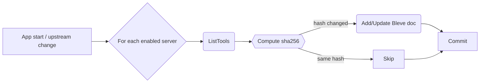
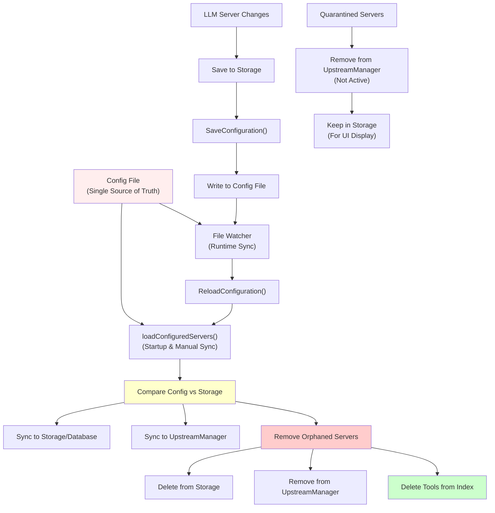
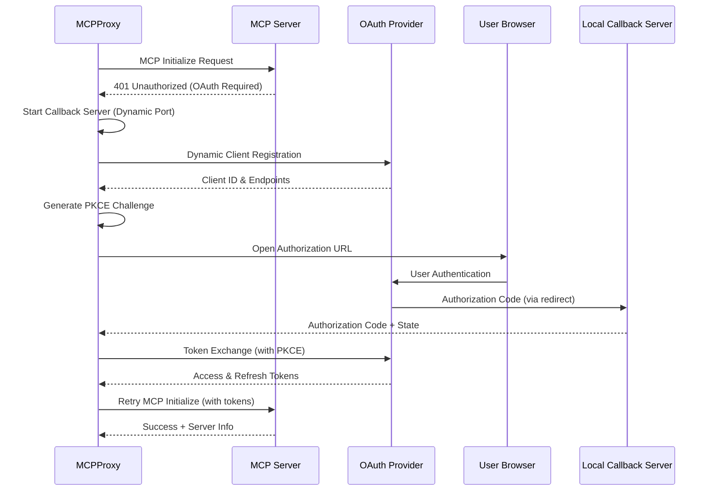

# mcpproxy-go — Design Document (v0.1.0)

## 1  Goals

Re‑implement the existing Python MCP proxy in Go, delivering a single‑binary desktop proxy with concurrent performance, local BM25 search, and a minimal cross‑platform system‑tray UI.

### MVP scope (v0.1)

* **Transport** – downstream Streamable‑HTTP only.
* **Built‑in MCP tools**

  * `retrieve_tools` – BM25 keyword search over all upstream tools.
  * `call_tool` – invoke any upstream tool.
  * `upstream_mcp_servers` – CRUD for upstream registry (`enabled` flag).
  * `tools_stat` – aggregate statistics (total tools, call counts, top‑N).
* **Index lifecycle** – full rebuild at start‑up and whenever an *enabled* upstream is added, removed or updated.
* **Tray UI** – first‑class feature; icon and systray menu only (no full GUI); toggle proxy, manage upstreams, show counters.
* **Local persistence** – defaults to `~/.mcpproxy/`:

  * `config.db` – bbolt key/value store (servers, stats, hashes).
  * `index.bleve/` – Bleve Scorch index (BM25).

## 2  Non‑Goals (v0.1)

* WebSocket/stdin transports, distributed indexing, vector search.

## 3  Tech Stack

| Concern           | Library                           | Reason                             |
| ----------------- | --------------------------------- | ---------------------------------- |
| MCP server/client | **`mark3labs/mcp-go`**            | Native Go, Streamable‑HTTP support |
| Full‑text search  | **Bleve v2**                      | Embeddable BM25                    |
| CLI & config      | **`spf13/cobra` + `spf13/viper`** | Flags → env → file binding         |
| Persistence       | **bbolt**                         | Single‑file ACID                   |
| Sys‑tray          | **`fyne.io/systray`**             | Tiny cross‑platform tray           |
| Logging           | **zap** / **slog**                | Structured logs                    |
| Metrics           | `prometheus/client_golang`        | Optional `/metrics`                |

## 4  Architecture Overview

```
┌────────────┐ Streamable‑HTTP ┌──────────────────────────────┐ Streamable‑HTTP ┌──────────────┐
│  Clients   │ ⇆ :8080 ⇆       │        mcpproxy‑go           │ ⇆  Upstream N ⇆ │  MCP Server  │
└────────────┘                 │                              │                 └──────────────┘
                               │  ┌───────────────┐           │
                               │  │ Tray Daemon   │───────────┘
                               │  └───────────────┘
                               │   ↙ Bleve index
                               └──→ bbolt (cfg, stats, hashes)
```

* **Downstream server** – `server.ServeStreamableHTTP`.
* **Upstream map** – persistent `client.Client` per *enabled* server.

  * On *add/enable* → call `ListTools`, compute hashes, rebuild index.
* **Indexer** – rebuilds index; swaps pointer atomically on finish.
* **Stats** – middleware increments per‑tool counters inside Bolt.

## 5  Naming & Hashing Scheme

* **`tool_name`** – canonical identifier used throughout the proxy.

  * Format: `<serverName>:<originalToolName>` (e.g. `prod:compress`).
* **`tool_hash`** – `sha256(serverName + toolName + parametersSchemaJSON)`.

  * Stored alongside tool metadata in both Bleve doc and Bolt `toolhash` bucket.
  * During re‑sync `ListTools` results are hashed; unchanged hashes skip re‑indexing.

## 6  Data Model (bbolt)

| Bucket      | Key           | Value                        |
| ----------- | ------------- | ---------------------------- |
| `upstreams` | `<uuid>`      | `{name,url,enabled,created}` |
| `toolstats` | `<tool_name>` | uint64 call‑count            |
| `toolhash`  | `<tool_name>` | 32‑byte sha256               |
| `meta`      | `schema`      | uint version                 |

## 7  Indexer Flow



* Bleve doc fields: `tool_name`, `server`, `description`, `tags`, `hash`.
* Query path: `retrieve_tools` → `bleve.Search` (MatchQuery) top‑20.

## 8  MCP Tool Specifications

### 8.1  `retrieve_tools`

```jsonc
Input:  {"query":"rate limit"}
Output: {"tools":[{"tool_name":"prod:compress","score":0.81}]}
```

### 8.2  `call_tool`

```jsonc
Input: {
  "name": "prod:compress",  // tool_name
  "args": {"text": "abc"}  // transparently forwarded
}
Output: <raw upstream JSON>
```

The proxy parses `name` to pick the correct upstream client and forwards `args` unchanged.

### 8.3  `upstream_mcp_servers`

```jsonc
Input:  {"operation":"add","url":"https://api.mcp.dev","name":"dev"}
Output: {"id":"uuid","enabled":true}
```

Operations: `list` / `add` / `remove` / `update` / `tail_log`.

#### 8.3.1 `tail_log` Operation

The `tail_log` operation allows LLMs to read recent log entries from a specific upstream server for debugging purposes:

```jsonc
Input:  {"operation":"tail_log","name":"dev","lines":50}
Output: {"server":"dev","lines":50,"log_entries":[...]}
```

**Parameters:**
- `name` (required): Server name to read logs from
- `lines` (optional): Number of recent lines to return (default: 50, max: 500)

**Use Case:** Enables AI agents to autonomously diagnose connection issues, authentication failures, and other upstream server problems by reading recent log entries.

### 8.4  `tools_stat`

Returns `{total_tools, top:[{tool_name,count}]}`.

## 9  Concurrency & Error Handling

* Bolt writes serialised via a `storage.Manager`.
* Upstream map behind `sync.RWMutex`.
* Index rebuild runs in goroutine; stale index served until swap.
* Panic‑safe wrappers restart crashed upstream clients.

## 10  CLI, Config & Tray

* `mcpproxy [--listen :8080] [--log-dir ~/.mcpproxy/logs] [--upstream "prod=https://api"]`
* Viper reads `$MCPP_` envs and `config.toml`.
* Tray (systray): icon + menu items (Enable, Disable, Add…, Reindex, Quit).

### 10.1 Logging System

#### Per-Upstream Server Logging

mcpproxy implements comprehensive per-upstream-server logging to facilitate debugging of connection issues and MCP communication problems.

**Log File Structure:**
```
~/.mcpproxy/logs/
├── main.log                    # Main application log
├── server-github.log           # GitHub MCP server interactions
├── server-filesystem.log       # Filesystem MCP server interactions
└── server-database.log         # Database MCP server interactions
```

**Log Content:**
- **MCP Protocol Messages**: All JSON-RPC messages between mcpproxy and upstream servers
- **Connection Events**: Connect, disconnect, retry attempts, and failures
- **Authentication**: OAuth flows, token refreshes, and auth errors
- **Process Output**: STDERR from stdio-based MCP servers
- **Timing Information**: Request/response latencies and timeout events

**Example Log Format:**
```
2025-06-04T03:42:38.375Z [github] [info] Connecting to upstream server
2025-06-04T03:42:38.630Z [github] [info] Connected successfully
2025-06-04T03:42:38.663Z [github] [debug] [Client→Server] initialize
2025-06-04T03:42:38.663Z [github] [debug] {"method":"initialize","params":{"protocolVersion":"2024-11-05","capabilities":{},"clientInfo":{"name":"mcpproxy-go","version":"1.0.0"}},"jsonrpc":"2.0","id":0}
2025-06-04T03:42:38.700Z [github] [debug] [Server→Client] 0
2025-06-04T03:42:38.700Z [github] [debug] {"jsonrpc":"2.0","id":0,"result":{"protocolVersion":"2024-11-05","capabilities":{"tools":{"listChanged":false}},"serverInfo":{"name":"GitHub MCP Server","version":"1.0.0"}}}
2025-06-04T03:42:41.670Z [github] [error] Connection error: HTTP 500 - Internal Server Error
2025-06-04T03:42:41.671Z [github] [info] Attempting reconnection in 5 seconds...
```

**CLI Configuration:**
- `--log-dir`: Specify custom log directory (default: OS-specific standard location)
- `--log-level`: Set log level for all loggers (debug, info, warn, error)
- Main application log: `main.log`
- Per-server logs: `server-{name}.log`

**Debug Commands:**
- `mcpproxy tools list --server=NAME --log-level=trace`: Debug individual server connections
- Enhanced trace logging shows all JSON-RPC frames and transport details

**Log Rotation:**
- Automatic rotation based on file size (10MB default)
- Configurable retention (5 backup files, 30 days default)
- Optional compression for rotated files

## 11  Build & Packaging

* Cross‑compile via `GOOS=darwin/windows/linux`.
* macOS: bundle into `.app`, sign & notarise; DMG + Homebrew Cask.
* Windows: `-H windowsgui` exe → MSIX/MSI; code‑sign EV cert.
* Icon embedded using `go:embed` + `.syso` for Windows.

## 12  Future Roadmap

* Incremental index updates on `tool_hash` diff.
* Hybrid BM25 + vector search.
* Auto‑update channel.
* GUI front‑end built with Wails.

## 12  Client Architecture (Refactored)

### 12.1 Modular Client Design

The upstream client architecture has been refactored into three distinct layers for better separation of concerns, testability, and reusability:

```
┌─────────────────┐    ┌─────────────────┐    ┌─────────────────┐
│   CLI Client    │    │ Managed Client  │    │   Core Client   │
│                 │    │                 │    │                 │
│ • CLI-specific  │ ──▶│ • State mgmt    │ ──▶│ • Basic MCP     │
│ • Debug output  │    │ • Concurrency   │    │ • Connection    │
│ • Tool display  │    │ • Background    │    │ • Auth fallback │
│ • Stderr monitor│    │   recovery      │    │ • No state      │
└─────────────────┘    └─────────────────┘    └─────────────────┘
```

**Core Interfaces:**
```go
// MCPClient - Basic MCP operations
type MCPClient interface {
    Connect(ctx context.Context) error
    Disconnect() error
    IsConnected() bool
    ListTools(ctx context.Context) ([]*config.ToolMetadata, error)
    CallTool(ctx context.Context, toolName string, args map[string]interface{}) (*mcp.CallToolResult, error)
    GetConnectionInfo() types.ConnectionInfo
    GetServerInfo() *mcp.InitializeResult
}

// StatefulClient - Adds state management
type StatefulClient interface {
    MCPClient
    GetState() types.ConnectionState
    IsConnecting() bool
    ShouldRetry() bool
    SetStateChangeCallback(callback func(oldState, newState types.ConnectionState, info *types.ConnectionInfo))
}
```

### 12.2 Core Client (`internal/upstream/core/`)

**Purpose:** Minimal, stateless MCP client implementation
- **Responsibility:** Direct MCP protocol communication
- **Features:**
  - Transport-agnostic (HTTP, SSE, stdio)
  - Authentication fallback (headers → no-auth → OAuth)
  - Environment variable filtering for stdio processes
  - No background processes or state management

**Key Components:**
- `client.go`: Main client implementation
- `auth.go`: Authentication strategies and fallback logic

### 12.3 Managed Client (`internal/upstream/managed/`)

**Purpose:** Stateful wrapper for daemon/long-running use
- **Responsibility:** Production-ready client for `mcpproxy serve`
- **Features:**
  - Connection state machine with retry logic
  - Background health monitoring and recovery
  - Concurrency control for ListTools operations
  - Exponential backoff for failed connections
  - State change notifications

**Key Features:**
```go
type ManagedClient struct {
    coreClient   *core.CoreClient
    StateManager *types.StateManager
    // Concurrency control
    listToolsMu sync.Mutex
    // Background monitoring
    stopMonitoring chan struct{}
}
```

### 12.4 CLI Client (`internal/upstream/cli/`)

**Purpose:** Specialized client for CLI debugging operations
- **Responsibility:** Enhanced debugging for `mcpproxy tools list`
- **Features:**
  - Detailed output formatting with emojis
  - JSON-RPC frame logging at trace level
  - Stderr monitoring for stdio processes
  - Single-shot operations (connect → list → disconnect)

**Debug Output Features:**
- **Transport Details:** All JSON-RPC request/response frames
- **Stderr Capture:** Real-time stderr output from stdio processes
- **Connection Events:** Detailed state transitions and timing
- **Error Context:** Enhanced error messages with troubleshooting hints

### 12.5 Shared Types (`internal/upstream/types/`)

**Purpose:** Common data structures to break import cycles
- **Connection States:** `Disconnected`, `Connecting`, `Authenticating`, `Discovering`, `Ready`, `Error`
- **State Manager:** Handles state transitions, retry logic, and callbacks
- **Connection Info:** Detailed connection metadata and error tracking

**State Machine:**
```
Disconnected ──▶ Connecting ──▶ Authenticating ──▶ Discovering ──▶ Ready
     ▲                │               │               │            │
     └────────────────┴───────────────┴───────────────┴────────────┘
                                   Error
```

### 12.6 Benefits of Refactored Architecture

1. **Separation of Concerns:**
   - Core: Pure MCP protocol implementation
   - Managed: Production state management
   - CLI: Debug-focused single operations

2. **Reusability:**
   - Core client shared between managed and CLI variants
   - State management logic isolated and testable
   - Transport logic decoupled from application logic

3. **Testability:**
   - Each layer can be unit tested independently
   - Mock interfaces for integration testing
   - Isolated state machine testing

4. **Maintainability:**
   - Clear responsibilities and boundaries
   - Smaller, focused code files
   - Type-safe interfaces between layers

## Upstream Server Management

### Dynamic Server Configuration

The proxy supports dynamic management of upstream MCP servers through the `upstream_servers` MCP tool. This enables:

- **Runtime Configuration**: Add, remove, and modify servers without restart
- **Batch Operations**: Import multiple servers simultaneously
- **Hot Reloading**: Immediate connection attempts and tool index updates
- **Persistent Storage**: Configuration automatically saved to disk

### Configuration Persistence

#### Storage Architecture

```
~/.mcpproxy/
├── mcp_config.json          # Main configuration file
├── data.bolt                # BoltDB storage (tool stats, metadata)
├── index.bleve/             # Search index directory
└── logs/                    # Log files directory
    ├── main.log             # Main application log
    └── server-*.log         # Per-upstream server logs
```

#### Configuration Flow

1. **Runtime Changes**: MCP tool calls modify server configurations
2. **Storage Update**: Changes written to BoltDB for immediate persistence
3. **Config Sync**: Configuration file updated with current state
4. **Connection Management**: Upstream manager connects/disconnects servers
5. **Index Update**: Tool discovery runs to update search index

#### Configuration Sync Architecture



The configuration sync system ensures **config file remains the single source of truth** by:

- **Bidirectional sync**: Changes in config file automatically sync to database and vice versa
- **Orphan cleanup**: Removes servers from database/index when removed from config file
- **Runtime changes**: LLM-added servers are immediately saved to config file
- **Startup reconciliation**: At startup, config file state overrides database state
- **File watching**: Runtime config file changes trigger automatic resync

### Server Types

#### HTTP Servers
- **Transport**: HTTP/HTTPS requests
- **Authentication**: Headers-based (API keys, tokens)
- **Configuration**: URL + optional headers
- **Example**: REST-based MCP servers

#### Stdio Servers  
- **Transport**: Standard input/output communication
- **Process Management**: Command execution with arguments
- **Environment**: Custom environment variables
- **Example**: Python/Node.js MCP server scripts

### Import Mechanisms

#### Cursor IDE Compatibility
- **Format**: Direct import of Cursor `mcp.json` configuration
- **Conversion**: Automatic mapping to internal server configuration
- **Validation**: Type detection and parameter validation

#### Batch Import
- **Multiple Servers**: Array of server configurations
- **Mixed Types**: HTTP and stdio servers in single operation
- **Error Handling**: Individual server failures don't block others

### Real-time Updates

#### Connection Management
- **Background Connections**: Non-blocking server connection attempts
- **Retry Logic**: Exponential backoff for failed connections
- **Status Tracking**: Real-time connection status updates

#### Tool Discovery
- **Automatic Indexing**: New servers trigger tool discovery
- **Search Updates**: BM25 index updated with new tools
- **Statistics**: Tool usage tracking across servers

#### UI Integration
- **Tray Updates**: System tray reflects server changes
- **Status Broadcasting**: Real-time status updates to UI components
- **Configuration Sync**: UI displays current server state

## Configuration Management

### First-Time Setup
When mcpproxy is first installed or the configuration directory doesn't exist, the system automatically:

1. **Creates default configuration directory** (`~/.mcpproxy` on macOS/Linux)
2. **Generates default configuration file** with sensible defaults:
   - Empty `mcpServers` array (no upstream servers configured initially)
   - Standard tool response limits and connection settings
   - Logging configuration with appropriate file rotation
   - Security settings (read-only mode, management controls)
3. **Logs the creation** with informational message for user awareness
4. **Preserves existing configuration** if file already exists (no override)

### Configuration Loading Priority
1. Command-line specified config file (`--config` flag)
2. Standard locations search:
   - `~/.mcpproxy/mcp_config.json`
   - `./mcp_config.json` (current directory)
3. **Auto-creation fallback** if no configuration found

## Process Lifecycle & Signal Handling

### Startup Sequence
1. **Configuration loading** (with auto-creation if needed)
2. **Logger initialization** (separate from config to allow early logging)
3. **Server component creation** (storage, index, upstream managers)
4. **Background operations startup** (connections, tool discovery)
5. **Transport layer activation** (HTTP server or stdio)
6. **Tray initialization** (if enabled)

### Signal Handling Architecture
The proxy implements robust signal handling with proper context propagation:

#### Context Hierarchy
```
Main Context (from signal)
    ├─ Server Context (for background operations)
    │   ├─ Background Connections
    │   ├─ Tool Discovery/Indexing  
    │   └─ Cache Management
    └─ HTTP Server Context (for request handling)
```

#### Graceful Shutdown Sequence
1. **Signal received** (SIGTERM, SIGINT)
2. **Main context cancelled** → triggers shutdown goroutine
3. **HTTP server shutdown** (5-second timeout, force close if needed)
4. **Background operations cancellation** (via server context)
5. **Resource cleanup** (storage, indexes, connections)
6. **Process termination**

#### Key Implementation Details
- **Double shutdown protection**: Guards against multiple shutdown calls
- **Context-aware operations**: All background goroutines respect cancellation
- **Proper HTTP server handling**: Uses `http.Server.Shutdown()` vs blocking `ListenAndServe()`
- **Logging throughout**: Every shutdown step is logged for debugging
- **Timeout management**: Prevents hanging on unresponsive operations

### OAuth2 Authentication Implementation

MCPProxy implements **OAuth 2.1 Authorization Code Flow with PKCE** for secure authentication with upstream MCP servers. The implementation is fully **RFC 8252 compliant** and handles the critical challenge of **exact URI matching** required by providers like Cloudflare.

#### Key Implementation Features

1. **Dynamic Port Allocation**: Each OAuth flow uses a unique, dynamically allocated port to avoid conflicts
2. **Callback Server Coordination**: Global callback server manager ensures proper lifecycle management
3. **RFC 8252 Compliance**: Uses `127.0.0.1` loopback interface with OS-assigned ephemeral ports
4. **PKCE Security**: Mandatory Proof Key for Code Exchange for all OAuth flows
5. **Automatic Retry**: OAuth-authenticated connections automatically retry MCP initialization

#### OAuth Flow Sequence



#### OAuth Configuration Structure

```go
type OAuthConfig struct {
    ClientID     string   `json:"client_id,omitempty"`
    ClientSecret string   `json:"client_secret,omitempty"`
    RedirectURI  string   `json:"redirect_uri,omitempty"`  // Dynamically generated
    Scopes       []string `json:"scopes,omitempty"`
    PKCEEnabled  bool     `json:"pkce_enabled,omitempty"`
}
```

#### Callback Server Management

The **Global Callback Server Manager** coordinates OAuth callback servers to ensure:

- **Unique Port Allocation**: Each server gets its own dedicated port
- **Lifecycle Management**: Proper startup, shutdown, and cleanup
- **Race Condition Prevention**: Port allocation and server startup are coordinated
- **Resource Management**: Automatic cleanup of unused callback servers

```go
type CallbackServerManager struct {
    servers map[string]*CallbackServer
    mu      sync.RWMutex
    logger  *zap.Logger
}

type CallbackServer struct {
    Port         int
    RedirectURI  string
    Server       *http.Server
    CallbackChan chan map[string]string
    logger       *zap.Logger
}
```

#### OAuth Integration with mcp-go

MCPProxy leverages the `mark3labs/mcp-go` library's native OAuth support:

- **OAuth-Enabled Clients**: Uses `client.NewOAuthStreamableHttpClient()` for HTTP transport
- **Automatic Detection**: Library automatically detects OAuth requirements (401 responses)
- **Built-in Flow Handling**: Library manages PKCE, state parameters, and token exchange
- **Dynamic Client Registration**: Automatic client registration when no pre-configured client ID

#### Error Handling and Retry Logic

- **Exponential Backoff**: Failed OAuth attempts use exponential backoff (1s, 2s, 4s, ...)
- **Timeout Handling**: 5-minute timeout for user authentication
- **State Validation**: Strict validation of OAuth state parameters
- **Graceful Degradation**: Clear error messages for common failure scenarios

#### Security Considerations

1. **PKCE Mandatory**: All OAuth flows use PKCE for code exchange security
2. **State Parameter**: Random state generation and validation prevents CSRF
3. **Localhost Binding**: Callback servers bind only to `127.0.0.1` loopback
4. **Token Storage**: In-memory token storage with automatic refresh
5. **Exact URI Matching**: Perfect URI consistency for Cloudflare OAuth compliance

## 13  Interface Architecture & Dependency Injection (P7)

### 13.1  Facades & Interfaces

To stabilize the codebase architecture and enable comprehensive testing, MCPProxy implements a clean interface layer using dependency injection patterns. This prevents accidental breakage during AI-assisted code modifications while enabling mock implementations for testing.

**Core Interfaces:**
- `UpstreamManager`: Manages MCP server connections and tool routing
- `IndexManager`: Handles BM25 search indexing and tool discovery
- `StorageManager`: Provides unified storage operations (BBolt + tool stats)
- `OAuthTokenManager`: Manages OAuth token lifecycle and persistence
- `DockerIsolationManager`: Controls Docker isolation for stdio servers
- `LogManager`: Provides per-server logging and log management
- `CacheManager`: Handles response caching with TTL management

### 13.2  Application Context (`internal/appctx`)

The application context provides clean dependency injection through interfaces:

```go
type ApplicationContext struct {
    UpstreamManager        UpstreamManager
    IndexManager           IndexManager
    StorageManager         StorageManager
    OAuthTokenManager      OAuthTokenManager
    DockerIsolationManager DockerIsolationManager
    LogManager             LogManager
    CacheManager           CacheManager
}
```

**Benefits:**
- **Interface Stability**: Contract tests lock method signatures to prevent breaking changes
- **Testability**: All dependencies can be mocked for unit testing
- **Modularity**: Clear separation of concerns between components
- **AI-Safe Architecture**: Interface constraints prevent LLM from accidentally breaking module contracts

### 13.3  Contract Testing

Comprehensive contract tests verify interface stability:
- **489 method signature assertions** across all interfaces
- **Compile-time verification** that implementations match interfaces
- **Runtime contract validation** to catch signature changes
- **Golden tests** that lock interface method sets

Example contract verification:
```go
// Contract tests will FAIL if this interface changes
type UpstreamManager interface {
    ConnectAll(ctx context.Context) error
    DiscoverTools(ctx context.Context) ([]*config.ToolMetadata, error)
    // ... other methods with locked signatures
}
```

### 13.4  Adapter Pattern Implementation

Adapters bridge legacy concrete implementations to new interfaces:
- `UpstreamManagerAdapter`: Wraps `upstream.Manager` with notification handling
- `CacheManagerAdapter`: Adapts `cache.Manager` to standardized cache interface
- `OAuthTokenManagerImpl`: Provides OAuth token management abstraction
- `DockerIsolationManagerImpl`: Abstracts Docker container lifecycle

## 14  Refactoring Status (P1-P7 Complete)

### ✅ **Major Refactoring Phases Completed**

**P1-P5: Core Architecture** ✅ **COMPLETED**
- Modular client architecture (core/managed/cli)
- Comprehensive logging system with per-server logs
- REST API with Server-Sent Events (SSE)
- System tray integration with API communication
- Configuration management and hot reload

**P6: Web UI Implementation** ✅ **COMPLETED**
- Vue 3 + TypeScript + Vite + DaisyUI frontend
- Embedded into Go binary with proper asset serving
- Real-time updates via Server-Sent Events
- Component-based architecture with Pinia state management
- Production build system with /ui/ route support

**P7: Interface Architecture & Dependency Injection** ✅ **COMPLETED**
- Clean interface layer for all major components (7 core interfaces)
- ApplicationContext with dependency injection
- 489 contract tests locking method signatures
- Adapter pattern bridging concrete implementations
- AI-safe architecture preventing accidental breaking changes

### 🎯 **Current Status: Production Ready**

The **next branch** represents a **complete architectural overhaul** with:
- **Stable Foundation**: Interface contracts prevent breaking changes
- **Modern Web UI**: Vue 3 frontend with real-time updates
- **Enhanced Testing**: Contract tests ensure API stability
- **Clean Architecture**: Proper separation of concerns and dependency injection

**Manual Testing Verified:**
- ✅ Web UI accessible at http://localhost:8080/ui/
- ✅ Asset loading works correctly with /ui/ base path
- ✅ Tool discovery and calling functionality
- ✅ Real-time server status updates
- ✅ Interface architecture prevents breaking changes

## 15  Future Roadmap

* Complete migration of HTTP/MCP/CLI layers to interface-based architecture
* Incremental index updates on `tool_hash` diff
* Hybrid BM25 + vector search
* Auto‑update channel
* GUI front‑end built with Wails
