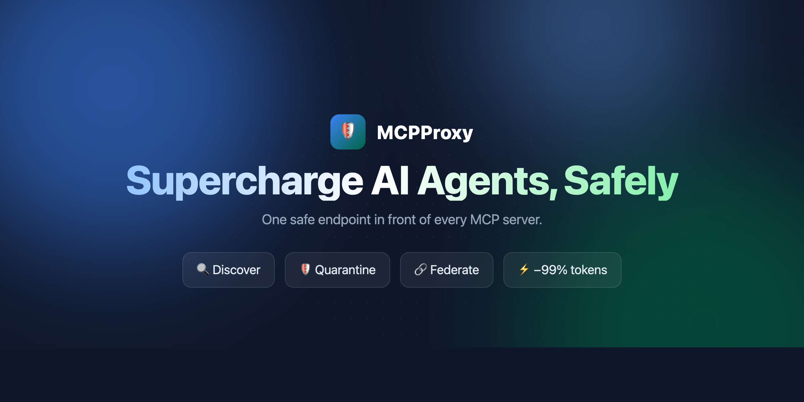
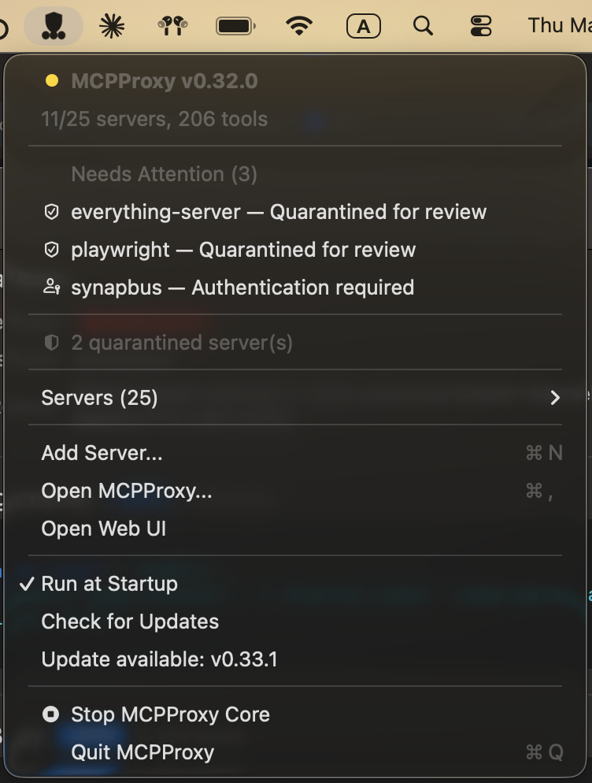
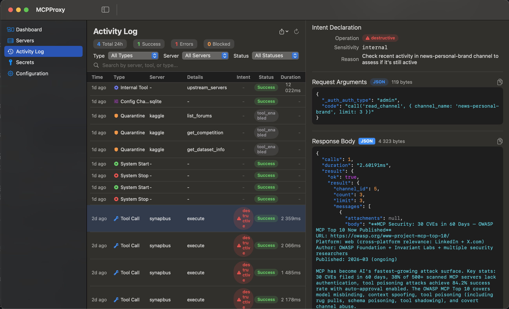

<p align="center">
  <a href="https://mcpproxy.app" target="_blank" rel="noopener">
    
  </a>
</p>

<div align="center">

[](https://github.com/smart-mcp-proxy/mcpproxy-go/releases)
[](https://github.com/smart-mcp-proxy/mcpproxy-go/actions/workflows/unit-tests.yml)
[](https://goreportcard.com/report/github.com/smart-mcp-proxy/mcpproxy-go)
[](https://pkg.go.dev/github.com/smart-mcp-proxy/mcpproxy-go)
[](LICENSE)
[](https://github.com/smart-mcp-proxy/mcpproxy-go/stargazers)
[](https://securityscorecards.dev/viewer/?uri=github.com/smart-mcp-proxy/mcpproxy-go)

</div>

<p align="center">
  
</p>

<p align="center">
  <strong>📺 <a href="https://youtu.be/2aKrgJnbbcw">Watch the full walkthrough</a></strong> &nbsp;·&nbsp;
  <strong>📚 <a href="https://docs.mcpproxy.app/">Read the docs</a></strong> &nbsp;·&nbsp;
  <strong>🌐 <a href="https://mcpproxy.app">mcpproxy.app</a></strong>
</p>

> The demo above shows the **embedded web UI**. The MCPProxy **core is a single binary for macOS, Linux, and Windows** — the web UI ships inside it, with no extra service to run. On **macOS**, an optional **menu‑bar app** adds one‑click convenience (start/stop, server health, quarantine, logs).

<div align="center">
  
  &nbsp;&nbsp;&nbsp;&nbsp;
  
  <br />
  <em>macOS menu‑bar app &nbsp;&nbsp;·&nbsp;&nbsp; Activity log &amp; audit in the macOS app</em>
</div>


## Why MCPProxy?

- **Scale beyond API limits** – Federate hundreds of MCP servers while bypassing Cursor's 40-tool limit and OpenAI's 128-function cap.
- **Save tokens & accelerate responses** – Agents load just one `retrieve_tools` function instead of hundreds of schemas. Research shows ~99 % token reduction with **43 % accuracy improvement**.
- **Advanced security protection** – Automatic quarantine blocks Tool Poisoning Attacks until you manually approve new servers.
- **Pluggable security scanners** – Run Snyk, Semgrep, Trivy, Cisco, and other Docker-based scanners against quarantined servers before you approve them; findings are normalized to SARIF with a composite risk score. See [Security scanner plugins](https://docs.mcpproxy.app/features/security-scanner-plugins/).
- **Works offline & cross-platform** – A single core binary for macOS (Intel & Apple Silicon), Windows (x64 & ARM64), and Linux (x64 & ARM64), with the **web UI embedded**. macOS additionally ships an optional menu-bar app.

---

## Quick Start

### 1. Install

**macOS (Recommended - DMG Installer):**

Download the latest DMG installer for your architecture:
- **Apple Silicon (M1/M2):** [Download DMG](https://github.com/smart-mcp-proxy/mcpproxy-go/releases/latest) → `mcpproxy-*-darwin-arm64.dmg`
- **Intel Mac:** [Download DMG](https://github.com/smart-mcp-proxy/mcpproxy-go/releases/latest) → `mcpproxy-*-darwin-amd64.dmg`

**Windows (Recommended - Installer):**

Download the latest Windows installer for your architecture:
- **x64 (64-bit):** [Download Installer](https://github.com/smart-mcp-proxy/mcpproxy-go/releases/latest) → `mcpproxy-setup-*-amd64.exe`
- **ARM64:** [Download Installer](https://github.com/smart-mcp-proxy/mcpproxy-go/releases/latest) → `mcpproxy-setup-*-arm64.exe`

The installer automatically:
- Installs both `mcpproxy.exe` (core server) and `mcpproxy-tray.exe` (system tray app) to Program Files
- Adds MCPProxy to your system PATH for command-line access
- Creates Start Menu shortcuts
- Supports silent installation: `.\mcpproxy-setup.exe /VERYSILENT`

**Alternative install methods:**

macOS (Homebrew):
```bash
# macOS — GUI tray app (recommended):
brew install --cask smart-mcp-proxy/mcpproxy/mcpproxy

# macOS / Linux — headless CLI only:
brew install smart-mcp-proxy/mcpproxy/mcpproxy
```

The cask installs the menu-bar app (bundles the CLI); the formula is the CLI binary only. Both update via `brew upgrade`.

Linux (Debian/Ubuntu) — apt repository, auto-updates via `apt upgrade`:
```bash
sudo install -m 0755 -d /etc/apt/keyrings
curl -fsSL https://apt.mcpproxy.app/mcpproxy.gpg \
  | sudo tee /etc/apt/keyrings/mcpproxy.gpg > /dev/null
echo "deb [arch=$(dpkg --print-architecture) signed-by=/etc/apt/keyrings/mcpproxy.gpg] https://apt.mcpproxy.app stable main" \
  | sudo tee /etc/apt/sources.list.d/mcpproxy.list > /dev/null
sudo apt update && sudo apt install mcpproxy
```

Linux (Fedora / RHEL / Rocky / AlmaLinux) — dnf repository, auto-updates via `dnf upgrade`:
```bash
sudo dnf config-manager --add-repo https://rpm.mcpproxy.app/mcpproxy.repo
# Fedora 41+ (dnf5): sudo curl -fsSL https://rpm.mcpproxy.app/mcpproxy.repo -o /etc/yum.repos.d/mcpproxy.repo
sudo dnf install -y mcpproxy
```

Arch Linux (AUR): [`mcpproxy-bin`](https://aur.archlinux.org/packages/mcpproxy-bin)
```bash
yay -S mcpproxy-bin
# or
git clone https://aur.archlinux.org/mcpproxy-bin.git && cd mcpproxy-bin && makepkg -si
```

The apt and dnf packages ship a hardened `systemd` unit and start the service automatically. Repository signing key fingerprint: `3B6F A1AD 5D53 59DA 51F1  8DDC E1B5 9B9B A1CB 8A3B`.

For one-off `.deb` / `.rpm` downloads (air-gapped installs), grab them from the [latest release](https://github.com/smart-mcp-proxy/mcpproxy-go/releases/latest).

Manual download (all platforms):
- **Linux tarball**: [AMD64](https://github.com/smart-mcp-proxy/mcpproxy-go/releases/latest/download/mcpproxy-latest-linux-amd64.tar.gz) | [ARM64](https://github.com/smart-mcp-proxy/mcpproxy-go/releases/latest/download/mcpproxy-latest-linux-arm64.tar.gz)
- **Windows**: [AMD64](https://github.com/smart-mcp-proxy/mcpproxy-go/releases/latest/download/mcpproxy-latest-windows-amd64.zip) | [ARM64](https://github.com/smart-mcp-proxy/mcpproxy-go/releases/latest/download/mcpproxy-latest-windows-arm64.zip)

**Prerelease Builds (Latest Features):**

Want to try the newest features? Download prerelease builds from the `next` branch:

1. Go to [GitHub Actions](https://github.com/smart-mcp-proxy/mcpproxy-go/actions)
2. Click the latest successful "Prerelease" workflow run
3. Download from **Artifacts**:
   - `dmg-darwin-arm64` (Apple Silicon Macs)
   - `dmg-darwin-amd64` (Intel Macs)
   - `versioned-linux-amd64`, `versioned-windows-amd64` (other platforms)

> **Note**: Prerelease builds are signed and notarized for macOS but contain cutting-edge features that may be unstable.

- **macOS**: [Intel](https://github.com/smart-mcp-proxy/mcpproxy-go/releases/latest/download/mcpproxy-latest-darwin-amd64.tar.gz) | [Apple Silicon](https://github.com/smart-mcp-proxy/mcpproxy-go/releases/latest/download/mcpproxy-latest-darwin-arm64.tar.gz)

Anywhere with Go 1.25+:
```bash
go install github.com/smart-mcp-proxy/mcpproxy-go/cmd/mcpproxy@latest
```

### 2. Run

```bash
mcpproxy serve          # starts HTTP server on :8080 and shows tray
```

### 3. Add your first server

Create or edit `~/.mcpproxy/mcp_config.json`:

```jsonc
{
  "listen": "127.0.0.1:8080",
  "mcpServers": [
    { "name": "local-python", "command": "python", "args": ["-m", "my_server"], "protocol": "stdio", "enabled": true },
    { "name": "remote-http", "url": "http://localhost:3001", "protocol": "http", "enabled": true }
  ]
}
```

See [Configuration](https://docs.mcpproxy.app/configuration/config-file/) and [Upstream Servers](https://docs.mcpproxy.app/configuration/upstream-servers/) for the full reference.

### 4. Connect to your IDE/AI tool

📖 **[Complete Setup Guide](docs/setup.md)** - Detailed instructions for Cursor, VS Code, Claude Desktop, and Goose

## Add proxy to Cursor

### One-click install into Cursor IDE

[](https://mcpproxy.app/cursor-install.html)

### Manual install


1. Open Cursor Settings
2. Click "Tools & Integrations"
3. Add MCP server
```json
    "MCPProxy": {
      "type": "http",
      "url": "http://localhost:8080/mcp/"
    }
```

---

## 🔐 Optional HTTPS Setup

MCPProxy works with HTTP by default for easy setup. HTTPS is optional and primarily useful for production environments or when stricter security is required.

**💡 Note**: Most users can stick with HTTP (the default) as it works perfectly with all supported clients including Claude Desktop, Cursor, and VS Code.

### Quick HTTPS Setup

**1. Enable HTTPS** (choose one method):
```bash
# Method 1: Environment variable
export MCPPROXY_TLS_ENABLED=true
mcpproxy serve

# Method 2: Config file
# Edit ~/.mcpproxy/mcp_config.json and set "tls.enabled": true
```

**2. Trust the certificate** (one-time setup):
```bash
mcpproxy trust-cert
```

**3. Use HTTPS URLs**:
- MCP endpoint: `https://localhost:8080/mcp`
- Web UI: `https://localhost:8080/ui/`

### Claude Desktop Integration

For Claude Desktop, add this to your `claude_desktop_config.json`:

**HTTP (Default - Recommended):**
```json
{
  "mcpServers": {
    "mcpproxy": {
      "command": "npx",
      "args": [
        "-y",
        "mcp-remote",
        "http://localhost:8080/mcp"
      ]
    }
  }
}
```

**HTTPS (With Certificate Trust):**
```json
{
  "mcpServers": {
    "mcpproxy": {
      "command": "npx",
      "args": [
        "-y",
        "mcp-remote",
        "https://localhost:8080/mcp"
      ],
      "env": {
        "NODE_EXTRA_CA_CERTS": "~/.mcpproxy/certs/ca.pem"
      }
    }
  }
}
```

### Certificate Management

- **Automatic generation**: Certificates created on first HTTPS startup
- **Multi-domain support**: Works with `localhost`, `127.0.0.1`, `::1`
- **Trust installation**: Use `mcpproxy trust-cert` to add to system keychain
- **Certificate location**: `~/.mcpproxy/certs/` (ca.pem, server.pem, server-key.pem)

### Troubleshooting HTTPS

**Certificate trust issues**:
```bash
# Re-trust certificate
mcpproxy trust-cert --force

# Check certificate location
ls ~/.mcpproxy/certs/

# Test HTTPS connection
curl -k https://localhost:8080/api/v1/status
```

**Claude Desktop connection issues**:
- Ensure `NODE_EXTRA_CA_CERTS` points to the correct ca.pem file
- Restart Claude Desktop after config changes
- Verify HTTPS is enabled: `mcpproxy serve --log-level=debug`

---

## Documentation

### Getting Started
- [Installation](https://docs.mcpproxy.app/getting-started/installation/)
- [Quick Start](https://docs.mcpproxy.app/getting-started/quick-start/)

### Configuration
- [Config File Reference](https://docs.mcpproxy.app/configuration/config-file/)
- [Upstream Servers](https://docs.mcpproxy.app/configuration/upstream-servers/)
- [Environment Variables](https://docs.mcpproxy.app/configuration/environment-variables/)

### Features
- [Search & Tool Discovery](https://docs.mcpproxy.app/features/search-discovery/)
- [Security Quarantine](https://docs.mcpproxy.app/features/security-quarantine/)
- [Security Scanner Plugins](https://docs.mcpproxy.app/features/security-scanner-plugins/)
- [Docker Security Isolation](https://docs.mcpproxy.app/features/docker-isolation/)
- [Secrets & Keyring Integration](https://docs.mcpproxy.app/features/keyring-integration/)
- [OAuth Authentication](https://docs.mcpproxy.app/features/oauth-authentication/)
- [Code Execution](https://docs.mcpproxy.app/features/code-execution/)
- [Activity Log](https://docs.mcpproxy.app/features/activity-log/)
- [Agent Tokens](https://docs.mcpproxy.app/features/agent-tokens/)
- [Sensitive Data Detection](https://docs.mcpproxy.app/features/sensitive-data-detection/)

### CLI Reference
- [Command Reference](https://docs.mcpproxy.app/cli/command-reference/)
- [Management Commands](https://docs.mcpproxy.app/cli/management-commands/)
- [Activity Commands](https://docs.mcpproxy.app/cli/activity-commands/)
- [Security Commands](https://docs.mcpproxy.app/cli/security-commands/)

### API
- [REST API](https://docs.mcpproxy.app/api/rest-api/)
- [MCP Protocol](https://docs.mcpproxy.app/api/mcp-protocol/)

---

## Contributing

We welcome issues, feature ideas, and PRs!

### Development Setup

```bash
make dev-setup                # Install swag, frontend deps, Playwright
brew install prek             # Install pre-commit hook runner (or: uv tool install prek)
prek install                  # Install pre-commit hooks
prek install --hook-type pre-push  # Install pre-push hooks
```

### Pre-commit Hooks

We use [prek](https://github.com/j178/prek) to catch issues before they reach CI:

| Hook | Stage | What it does |
|------|-------|-------------|
| `gofmt` | pre-commit | Auto-formats staged Go files |
| `trailing-whitespace` | pre-commit | Removes trailing whitespace |
| `end-of-file-fixer` | pre-commit | Ensures files end with newline |
| `check-merge-conflict` | pre-commit | Detects merge conflict markers |
| `swagger-verify` | pre-push | Fails if OpenAPI spec is out of date |
| `go-build` | pre-push | Verifies the project compiles |

Run hooks manually: `prek run --all-files`

### Build & Test

```bash
make build          # Build frontend + backend
make swagger        # Regenerate OpenAPI spec
make test           # Unit tests
make test-e2e       # E2E tests
make lint           # Run linters
```
