<!-- GENERATED FILE — do not edit by hand. -->
<!-- Source: roadmap.yaml  ·  Generator: scripts/gen-roadmap.py -->
<!-- Regenerate: python3 scripts/gen-roadmap.py  (or scripts/gen-roadmap) -->

# MCPProxy Roadmap

> **Generated — do not edit by hand.** This file is rendered from [`roadmap.yaml`](./roadmap.yaml) by [`scripts/gen-roadmap.py`](./scripts/gen-roadmap.py). Edit `roadmap.yaml` and re-run the generator.

The roadmap models cross-spec **epics → tasks** with a dependency DAG, execution `status`, `priority`, and links — the things a per-spec `tasks.md` checkbox list cannot express. Per-spec checkbox progress is recomputed live from each `specs/<NNN>/tasks.md`.

[`roadmap.yaml`](./roadmap.yaml) holds the **working set** (todo · in-progress · in-review · blocked · parked). Cold shipped epics are swept into [`roadmap.archive.yaml`](./roadmap.archive.yaml) and surface in the [Shipped](#shipped-archived) table below, so the working file stays small while provenance survives. A `depends_on:` edge into the archive is satisfied by definition.

## How to regenerate

```bash
python3 scripts/gen-roadmap.py     # writes ROADMAP.md
scripts/gen-roadmap                # convenience wrapper (same thing)
python3 scripts/gen-roadmap.py --check          # CI canary: fail if ROADMAP.md is stale
python3 scripts/gen-roadmap.py --check-github   # cross-check statuses vs live GitHub PR state,
                                                # spec links, depends_on ids, and status sanity
                                                # (add --strict to fail on warnings; needs gh)
python3 scripts/gen-roadmap.py --archive --dry-run   # preview the cold-done sweep
python3 scripts/gen-roadmap.py --archive             # sweep into roadmap.archive.yaml + regenerate
```

## roadmap.yaml schema (short form)

- **epics[]** — each has `id` (stable slug, DAG node), `title`, `status` (todo·in_progress·in_review·blocked·done), `priority` (P0–P3), `depends_on: [ids]` (DAG edges, prerequisite→dependent), optional `parked: true`, and links `spec:` / `pr:` / `mcp:` (external MCP-xxxx).
- **epics[].tasks[]** — child tasks with the same fields; their `depends_on` may reference sibling tasks or other epics.
- See the header comment in `roadmap.yaml` for the full field reference.

## Roadmap at a glance

The cross-epic dependency graph — **one node per epic**, edges point prerequisite → dependent. Task-level detail lives in the collapsible sections below, and dependency-free epics are listed under the graph rather than drawn as disconnected boxes, so this stays legible at default zoom. Node colour = status: 🟢 done · 🔵 in-progress · 🟡 in-review · 🔴 blocked · ⚪ todo · ⚫ parked.

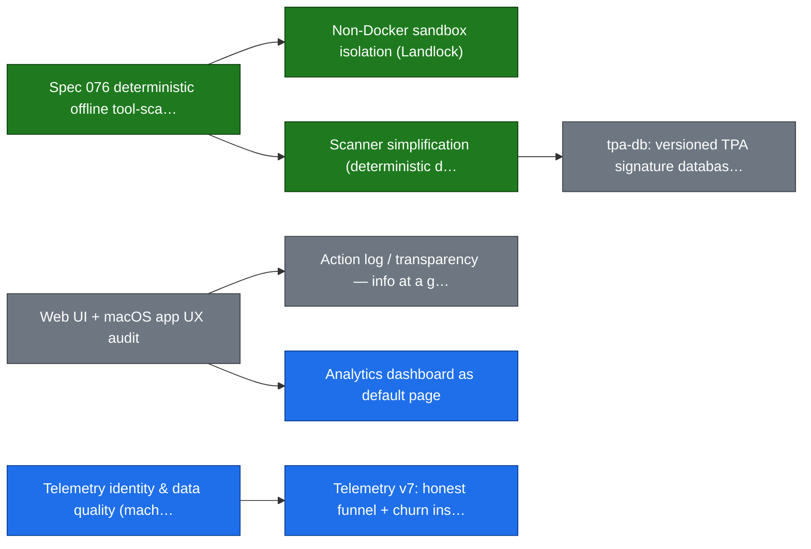

**Independent epics** (15) — no cross-epic prerequisites; each stands alone:

- 🔵 **Upgrade awareness & guided update** — In progress · P0
- 🔵 **Connect step trust: preview, visible backup, one-click undo** — In progress · P0
- 🔵 **Release qualification gate (auto-QA matrix blocks the tag)** — In progress · P0
- 🟡 **Windows native tray app** — In review · P2
- 🔴 **MCP protocol upgrade to 2026-07-28 revision** — Blocked · P3
- ⚪ **Planning/docs truth automation** — Todo · P2
- ⚫ **Server marketplace** — Todo · P3 · parked
- ⚫ **Audit SIEM integration** — Todo · P3 · parked
- ⚫ **Paid-tier MVP (billing / seats / license)** — Todo · P3 · parked
- ⚫ **SDK v1 migration** — Todo · P3 · parked
- ⚫ **SSO (server edition)** — Todo · P3 · parked
- ⚪ **Security gateway Tracks C/D (per-arg least-privilege + signature provenance)** — Todo · P3
- ⚪ **Discovery-quality eval harness (Spec 065 second half)** — Todo · P3
- 🟢 **Registries — easier search + add-server** — Done · P1
- 🟢 **Tray↔core decoupling: socket/REST API only, no config-file reads** — Done · P2

## Epic details

Each epic's child tasks, their internal dependency graph, and tracker/PR links — **collapsed by default**, expand the ones you care about. Full metadata (priority, spec progress) is in the [Epics](#epics) table below.

<details>
<summary>🔵 Upgrade awareness &amp; guided update — In progress · P0</summary>

> Corrected CI-filtered telemetry (2026-07-02): ~60% of last-14d active installs run pre-v0.40; latest stable v0.46.0 only 18.7%. Turn the existing internal/updatecheck background poll into a universal, non-intrusive, channel-aware upgrade nudge across every surface. Never blocks/modals; silent offline/CI.

Spec: [079-upgrade-nudge](./specs/079-upgrade-nudge/)

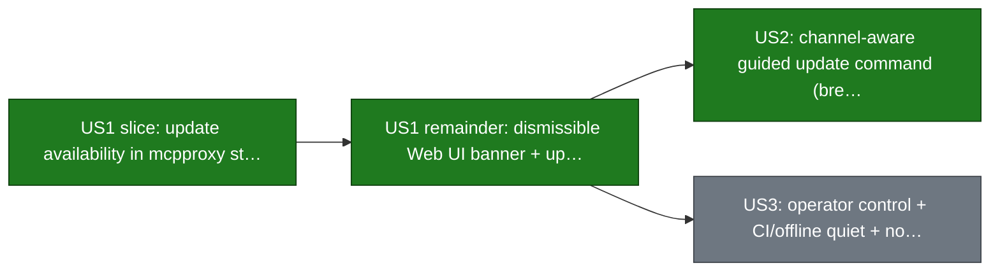

| Task | Status | Refs |
| --- | --- | --- |
| US1 slice: update availability in mcpproxy status + deduped startup log | 🟢 Done | #798 |
| US1 remainder: dismissible Web UI banner + update_check config block | 🟢 Done | #805 |
| US2: channel-aware guided update command (brew/dmg/deb/rpm/docker/go-install detection, build-time channel marker) | 🟢 Done | #818 |
| US3: operator control + CI/offline quiet + no prerelease downgrade nudges | ⚪ Todo | — |

</details>

<details>
<summary>🔵 Connect step trust: preview, visible backup, one-click undo — In progress · P0</summary>

> Legacy wizard telemetry APPEARED to show 72.4% of engaged users skipping the connect step - debunked 2026-07-06: an instrumentation artifact, genuine never-connected skip = 0% (the wizard stamped skipped on users who connected via ConnectModal/CLI/manual config); real cliff is one-and-done installs ~48% (day-1 return 31%, identity-deduped 2026-07-10), see specs/080. Completers retain ~50% at two weeks vs 6% for non-engaged (correlation with engagement, not causation by the connect step). Backups already exist (internal/connect/backup.go) but are invisible in the Web UI. Close the trust gap: preview the exact config diff, surface the backup, offer one-click undo, explain the macOS TCC prompt.

Spec: [078-connect-trust-preview](./specs/078-connect-trust-preview/)

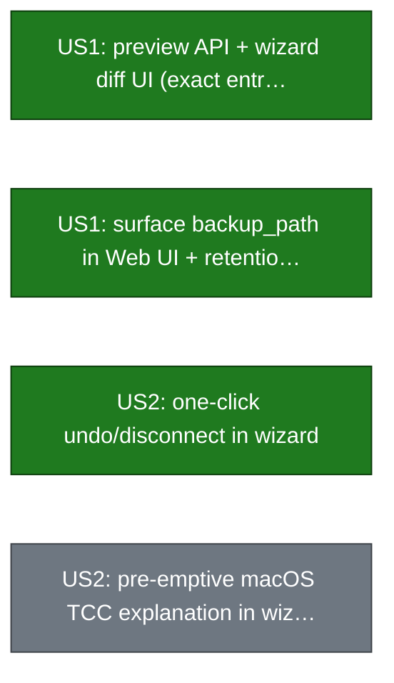

| Task | Status | Refs |
| --- | --- | --- |
| US1: preview API + wizard diff UI (exact entry, API-key masking) | 🟢 Done | #802 |
| US1: surface backup_path in Web UI + retention policy | 🟢 Done | #799 |
| US2: one-click undo/disconnect in wizard | 🟢 Done | #804 |
| US2: pre-emptive macOS TCC explanation in wizard | ⚪ Todo | — |

</details>

<details>
<summary>🔵 Release qualification gate (auto-QA matrix blocks the tag) — In progress · P0</summary>

> Attacks the return cliff (48% of installs are one-and-done; day-1 return 31% — corrected 2026-07-10, identity-deduped; the earlier '17.7% day-2' figure was un-deduped anonymous_id churn) and the one conceded competitor advantage: stability. No release tag until the surface x server-type matrix (MCP/REST/CLI/Web UI x stdio/http/sse/docker/oauth) plus invariants (activity-log/token counters move, quarantine flow, reconnect survival, in-place upgrade) pass automatically; macOS app smoke is advisory until promoted (3 consecutive passes, spec 081 US4). Assembles existing assets: test-api-e2e.sh, Playwright sweep, scan-eval gate, mcpproxy-ui-test.

Spec: [081-release-qa-gate](./specs/081-release-qa-gate/)

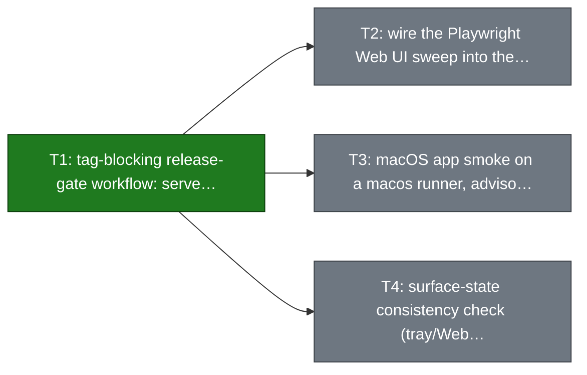

| Task | Status | Refs |
| --- | --- | --- |
| T1: tag-blocking release-gate workflow: server-type matrix (stdio/http/sse/docker/oauth) + invariants (activity-log/request-id, token+telemetry counters, quarantine flow, reconnect, upgrade-in-place), publish jobs gated on the verdict, scan-eval unconditional on tags | 🟢 Done | #819 |
| T2: wire the Playwright Web UI sweep into the gate (currently manual-trigger only) | ⚪ Todo | — |
| T3: macOS app smoke on a macos runner, advisory until 3 consecutive passes (today zero CI automation for the tray app) | ⚪ Todo | — |
| T4: surface-state consistency check (tray/Web UI/CLI agree with core on server states) | ⚪ Todo | — |

</details>

<details>
<summary>🔵 Analytics dashboard as default page — In progress · P1</summary>

> Per-server / per-tool token-drain graphs; make the dashboard the default landing page. 2026-07-10 truth-sync: spec 069 is SHIPPED (25/26 — the only open task is a Playwright verification sweep), so the graphs half is done; only the default-landing half remains.

Spec: [069-observability-usage-graphs](./specs/069-observability-usage-graphs/)


| Task | Status | Refs |
| --- | --- | --- |
| Per-server / per-tool token-drain graphs | 🟢 Done | — |
| Make dashboard the default landing page | ⚪ Todo | — |

</details>

<details>
<summary>🔵 Telemetry identity &amp; data quality (machine_id + CI-filter hardening) — In progress · P1</summary>

> 2026-07-11 source audit: the CLIENT half is DONE and RELEASED — the old framing ('add a hashed machine_id (schema v6)') is stale. machine_id (HMAC-SHA256 of the OS machine id, internal/telemetry/machine_id.go) is emitted unconditionally in every heartbeat (telemetry.go:789; telemetry is opt-out) and shipped in v0.47.0; the client schema is already v7, a version past the v6 this note described; CI is filtered client-side by disabling telemetry outright (env_overrides.go). Worker verified live in prod 2026-07-07 (machine_id 100% populated). The audit also found that the 79%-unknown launch_source was a CLIENT bug misfiled to mcpproxy-dash — a dashboard cannot display a value the client is incapable of sending. That is now fixed (see telemetry-launchsource-tray). Remaining: dashboard consumption (mcpproxy-dash) + snapshot-cron alerting.

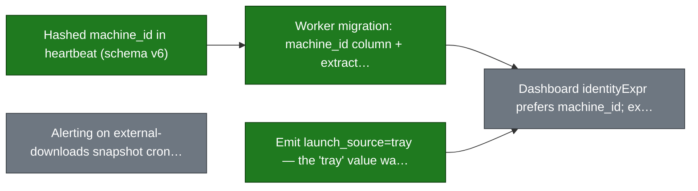

| Task | Status | Refs |
| --- | --- | --- |
| Hashed machine_id in heartbeat (schema v6) | 🟢 Done | https://github.com/smart-mcp-proxy/mcpproxy-go/pull/796 |
| Worker migration: machine_id column + extraction (repo mcpproxy-telemetry) | 🟢 Done | mcpproxy-telemetry#3 |
| Emit launch_source=tray — the 'tray' value was UNREACHABLE in the client, and that (not the dashboard) was the 79%-unknown root cause | 🟢 Done | — |
| Dashboard identityExpr prefers machine_id; exclude %-dev versions from human cohort (repo mcpproxy-dash) | ⚪ Todo | — |
| Alerting on external-downloads snapshot cron (34-day outage went unnoticed) | ⚪ Todo | — |

</details>

<details>
<summary>🔵 Telemetry v7: honest funnel + churn instrumentation — In progress · P1</summary>

> 2026-07-06 recheck DEBUNKED the 72.4% connect-skip story: genuine never-connected skip = 0% (wizard dismiss stamped 'skipped' on users who connected via ConnectModal/CLI/manual config). 2026-07-10 recheck debunked the OTHER two spec-080 headline metrics as well: 'day-2 return 17.7%' was un-deduped anonymous_id churn (true, identity-deduped: one-and-done 48%, day-1 return 31%, day-7 16.6% — matches dashboard); '42% retrieve_tools -> 16% real call' was lifetime-flag vs windowed-counter asymmetry (true conversion ~90%; missing piece is a first_real_tool_call_ever activation flag). Real cliff = 48% one-and-done. 2026-07-11 source audit + fix: ALL of spec 080 is shipped and released in v0.47.0 (#813) — T1 wizard completed_external, T2 funnel fields, T3 pre-churn snapshot, US4 schema v7. The previous note claimed 'only cross-repo churn analytics (T4) remains'; that was WRONG — first_real_tool_call_ever had ZERO occurrences in Go code and was in-repo CLIENT work. It is now implemented, so the retrieve->call funnel is finally measurable lifetime-vs-lifetime. P0->P1: only cross-repo T4 now remains.

Spec: [080-telemetry-v7-churn](./specs/080-telemetry-v7-churn/)

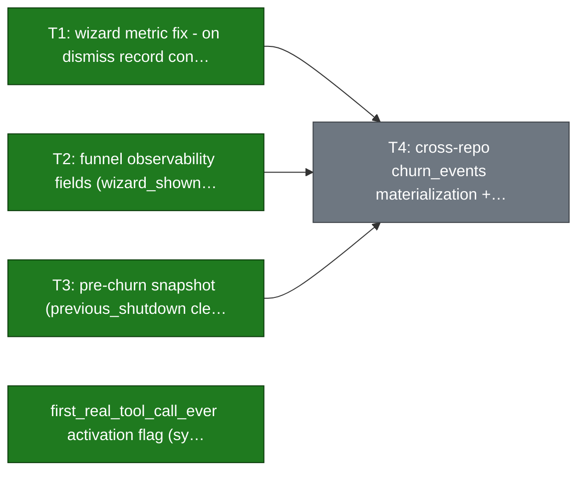

| Task | Status | Refs |
| --- | --- | --- |
| T1: wizard metric fix - on dismiss record connect step as completed_external (not skipped) when the user already connected via another path | 🟢 Done | #813 |
| T2: funnel observability fields (wizard_shown, web_ui_opened counter, days_since_install, active_days_30d) | 🟢 Done | #813 |
| T3: pre-churn snapshot (previous_shutdown clean\|crash via BBolt flag, last_error_code) so the final heartbeat doubles as cause-of-death | 🟢 Done | #813 |
| first_real_tool_call_ever activation flag (symmetric to first_retrieve_tools_call_ever) so the retrieve->call funnel step is measurable lifetime-vs-lifetime | 🟢 Done | — |
| T4: cross-repo churn_events materialization + dash Churn page with H1-H4 hypothesis signatures (repos mcpproxy-telemetry / mcpproxy-dash; tracked here for DAG visibility, out of scope of spec 080) | ⚪ Todo | — |

</details>

<details>
<summary>🟡 Windows native tray app — In review · P2 · MCP-43</summary>

> No spec: link — this epic is the native TRAY app; specs/002-windows-installer is the unrelated INSTALLER spec (35/60) and its badge said nothing about tray progress (wrong link removed 2026-07-10). Option C: WebView2 window reusing shipped Web UI. Most exit criteria already ship; gaps = native window, toasts, profile submenu, Win11 smoke. Telemetry: Windows = ~23% of GitHub downloads but only ~4% of active installs (downloads→actives ~12:1 vs macOS ~4:1) — gate WebView2 work on finding the funnel break first.


| Task | Status | Refs |
| --- | --- | --- |
| Windows first-run QA pass (downloads→actives 12:1 vs macOS 4:1 — find the funnel break before WebView2 work) | ⚪ Todo | — |
| WebView2 native window + profile submenu | 🟡 In review | `MCP-43` |

</details>

<details>
<summary>🔴 MCP protocol upgrade to 2026-07-28 revision — Blocked · P3</summary>

> BLOCKED on mcp-go shipping 2026-07-28 (pinned v0.55.x tops out at 2025-11-25). CROSS-SPEC CONFLICT: FR-012 forbids per-connection */list variation; SHIPPED Spec 057 selects toolset by URL path /mcp/p/<slug>. Must reconcile at plan time (058 spec now carries a Cross-Spec Reconciliation note). 028 agent-token scoping is already compatible (header-carried).

Spec: [058-mcp-2026-upgrade](./specs/058-mcp-2026-upgrade/)

</details>

<details>
<summary>⚪ Web UI + macOS app UX audit — Todo · P0</summary>

> End-to-end UX pass across Web UI and the macOS tray app; the umbrella for the polish push. (No spec yet — 064 is the unrelated agent-fleet glass-cockpit spec.)

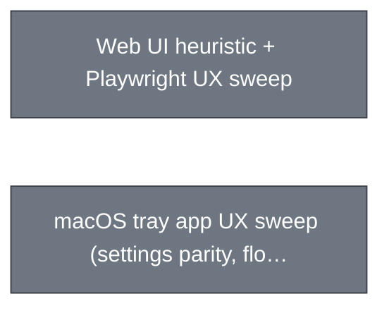

| Task | Status | Refs |
| --- | --- | --- |
| Web UI heuristic + Playwright UX sweep | ⚪ Todo | — |
| macOS tray app UX sweep (settings parity, flows) | ⚪ Todo | — |

</details>

<details>
<summary>⚪ Action log / transparency — info at a glance — Todo · P1</summary>

> Surface the most important activity/security/connection signals at a glance; reduce digging. Vision pillar 'feel control → transparency' — the activity log is a headline feature, polish it and bring it to the tray menu. Builds on the shipped activity-log backend + retention (spec 024, 95% shipped — this epic is the at-a-glance UX on top, not the backend, so 024 is not the progress driver).

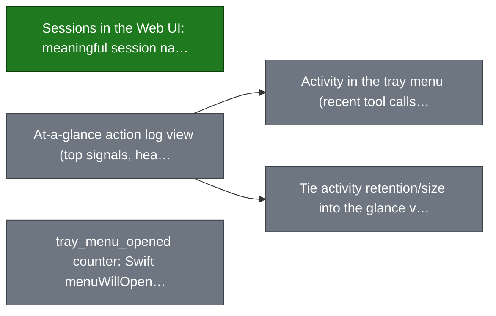

| Task | Status | Refs |
| --- | --- | --- |
| Sessions in the Web UI: meaningful session names in the Activity Log filter + the existing /sessions page linked in the sidebar | 🟢 Done | — |
| At-a-glance action log view (top signals, health) | ⚪ Todo | — |
| Activity in the tray menu (recent tool calls + security events, jump to full log) | ⚪ Todo | — |
| tray_menu_opened counter: Swift menuWillOpen (MCPProxyApp.swift:192) -> lightweight POST /api/v1/telemetry/tray-menu-opened -> registry counter -> heartbeat tray_menu_opened_24h | ⚪ Todo | — |
| Tie activity retention/size into the glance view | ⚪ Todo | — |

</details>

<details>
<summary>⚪ tpa-db: versioned TPA signature database for the offline scanner — Todo · P1</summary>

> Vision pillar 'feel protected': the deterministic detect engine (Spec 076/077) ships with built-in checks but no updatable knowledge of in-the-wild Tool Poisoning Attacks. Build a versioned, offline-first signature/pattern database (known TPA campaigns, malicious phrase corpora, IoC hashes) that the engine consumes — bundled with the binary, refreshable out-of-band, community-contributable, and guarded by the existing scan-eval recall/FP CI gate.

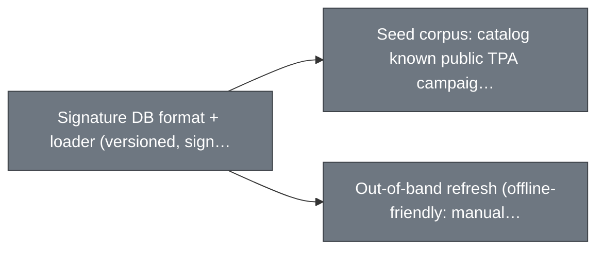

| Task | Status | Refs |
| --- | --- | --- |
| Signature DB format + loader (versioned, signed, bundled default) | ⚪ Todo | — |
| Seed corpus: catalog known public TPA campaigns/patterns into the DB | ⚪ Todo | — |
| Out-of-band refresh (offline-friendly: manual file drop + optional fetch), eval-gated | ⚪ Todo | — |

</details>

<details>
<summary>⚪ Planning/docs truth automation — Todo · P2</summary>

> Automate the consistency checks this very audit had to do by hand: roadmap vs GitHub PR state, tasks.md updates on implementation PRs, volatile CLAUDE.md/README facts, and quickstart contract tests.

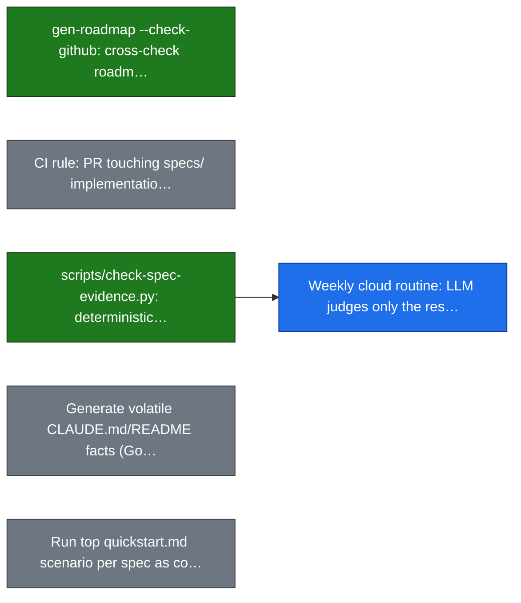

| Task | Status | Refs |
| --- | --- | --- |
| gen-roadmap --check-github: cross-check roadmap.yaml statuses vs gh PR state + dangling spec links | 🟢 Done | #800 |
| CI rule: PR touching specs/<id> implementation paths must update tasks.md | ⚪ Todo | — |
| scripts/check-spec-evidence.py: deterministic check that every TICKED task cites code that exists | 🟢 Done | — |
| Weekly cloud routine: LLM judges only the residue the evidence-check cannot decide, opens/updates one propose-only PR | 🔵 In progress | — |
| Generate volatile CLAUDE.md/README facts (Go version, built-in tool list, sample config) from code with --check | ⚪ Todo | — |
| Run top quickstart.md scenario per spec as contract test in test-api-e2e.sh | ⚪ Todo | — |

</details>

<details>
<summary>⚪ Security gateway Tracks C/D (per-arg least-privilege + signature provenance) — Todo · P3</summary>

> Track A→Spec 056, Track B→Spec 059 (both shipped). UNBUILT: Track C per-ARGUMENT allow-listing (per-tool scope exists in mcp_direct_scope.go); Track D provenance + human-readable signature diff (SHA-256 pinning exists via Spec 032). Build ON 032/028, don't re-implement; honor the rug-pull re-quarantine interaction rule vs 032 auto-approve.

Spec: [054-mcp-security-gateway](./specs/054-mcp-security-gateway/)

</details>

<details>
<summary>⚪ Discovery-quality eval harness (Spec 065 second half) — Todo · P3</summary>

> Security recall/FP half SHIPPED (cmd/scan-eval, backs Spec 076/077 gate). UNBUILT: the discovery-quality (retrieve_tools recall) eval harness.

Spec: [065-evaluation-foundation](./specs/065-evaluation-foundation/)

</details>

<details>
<summary>⚫ Server marketplace — Todo · parked · P3 · MCP-37</summary>

> PARKED. ~60% already ships (browse/search/one-click add). No spec yet; gaps tracked as MCP-3246..3250 (tray entries, metadata, telemetry). (070 is the registries-search-add spec, not a marketplace spec.)

</details>

<details>
<summary>⚫ Audit SIEM integration — Todo · parked · P3 · MCP-39</summary>

> PARKED. Splunk HEC / Elastic _bulk / syslog shippers reusing JSONL export pipeline.

</details>

<details>
<summary>⚫ Paid-tier MVP (billing / seats / license) — Todo · parked · P3 · MCP-40</summary>

> PARKED. Server-edition revenue motion: Ed25519 license tokens, seats, Stripe checkout. Behind //go:build server.

</details>

<details>
<summary>⚫ SDK v1 migration — Todo · parked · P3</summary>

> PARKED. Migrate to the v1 MCP Go SDK surface.

</details>

<details>
<summary>⚫ SSO (server edition) — Todo · parked · P3</summary>

> PARKED. Single sign-on for the multi-user server edition.

</details>

<details>
<summary>🟢 Non-Docker sandbox isolation (Landlock) — Done · P1 · MCP-34</summary>

> Landlock LSM + setrlimit native sandbox for stdio upstreams; no userns (Ubuntu 24.04 safe). Originated from roadmap item #11 (no dedicated spec — 054 is the unrelated security-gateway spec). Code in internal/sandbox/; PRs #754/#759/#768/#781/#782.


| Task | Status | Refs |
| --- | --- | --- |
| Landlock sandbox spike (MCP-34.1) | 🟢 Done | `MCP-3232` #754 |
| isolation.mode enum + resolver (MCP-34.2) | 🟢 Done | `MCP-3233` #759 |
| Native sandbox launcher Landlock+rlimits (MCP-34.3) | 🟢 Done | `MCP-3234` #768 |
| Scanner-flow parity under sandbox (MCP-34.4) | 🟢 Done | `MCP-3235` #781 |
| snap-docker integration tests + CI (MCP-34.5) | 🟢 Done | `MCP-3236` #782 |

</details>

<details>
<summary>🟢 Spec 076 deterministic offline tool-scanner — Done · P1 · MCP-3574</summary>

> Deterministic offline signal pipeline replaces ~10%-recall scanner; scan-eval --gate (recall>=0.90 / FP<=5%) in CI.

Spec: [076-deterministic-tool-scanner](./specs/076-deterministic-tool-scanner/)

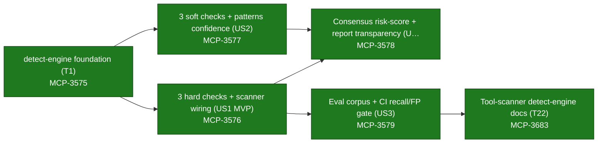

| Task | Status | Refs |
| --- | --- | --- |
| detect-engine foundation (T1) | 🟢 Done | `MCP-3575` #769 |
| 3 hard checks + scanner wiring (US1 MVP) | 🟢 Done | `MCP-3576` #770 |
| 3 soft checks + patterns confidence (US2) | 🟢 Done | `MCP-3577` #775 |
| Consensus risk-score + report transparency (US4) | 🟢 Done | `MCP-3578` #776 |
| Eval corpus + CI recall/FP gate (US3) | 🟢 Done | `MCP-3579` #777 |
| Tool-scanner detect-engine docs (T22) | 🟢 Done | `MCP-3683` #780 |

</details>

<details>
<summary>🟢 Registries — easier search + add-server — Done · P1</summary>

> Lower the friction of finding a server in a registry and adding it; lean on the official registry protocol work. 2026-07-10 truth-sync: both children shipped — spec 070 is 21/24 (the 3 open tasks are pre-PR chores: worktree baseline, run gates, apply gate decisions) and 071 is 12/12. depends_on [ux-audit] dropped: a done epic cannot depend on a todo one.

Spec: [070-registry-easy-upstream-add](./specs/070-registry-easy-upstream-add/)

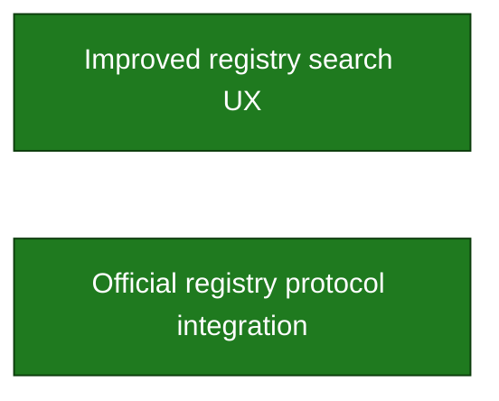

| Task | Status | Refs |
| --- | --- | --- |
| Improved registry search UX | 🟢 Done | — |
| Official registry protocol integration | 🟢 Done | — |

</details>

<details>
<summary>🟢 Scanner simplification (deterministic default, opt-in deep scan) — Done · P1</summary>

> Make the Spec 076 detect engine the always-on offline default; demote Docker scanners + source extraction to opt-in deep scan that never blocks/degrades the baseline; single unified report. COMPLETE: US1 #786, US2 #792, US4 #794, US3 + deep-scan trust fixes + docs truth sweep (T037-T039) #793 — all merged; shipped in v0.47.0-rc.2. Remaining 4 unchecked tasks in tasks.md are documented scope-outs. First of the 5 personal-edition polish verticals.

Spec: [077-scanner-simplification](./specs/077-scanner-simplification/)


| Task | Status | Refs |
| --- | --- | --- |
| US1: deterministic offline baseline default + curated hard phrase_injection check (delete duplicate legacy rules) | 🟢 Done | #786 |
| US2: single merged report + cross-scanner consensus confidence | 🟢 Done | #792 |
| US3: opt-in deep scan (off by default), never blocks/degrades baseline; config migration | 🟢 Done | #793 |
| US4: collapse scan-notification storm into one debounced settled event (MCP-2207) | 🟢 Done | #794 |
| Deep-scan trust fixes: nil-Security gating bug (source fetch runs with deep scan off on default configs), FR-014 verdict inversion (Dangerous deep finding < Warning), surface silently-skipped Docker scanners (non-nil deep_scan descriptor + CLI hint on security enable) | 🟢 Done | #793 |

</details>

<details>
<summary>🟢 Tray↔core decoupling: socket/REST API only, no config-file reads — Done · P2</summary>

> Architecture rule (CLAUDE.md): the tray holds no state and talks to the core only via socket/REST + SSE. 2026-07-11 source-of-truth re-audit + fix: Swift tray was already clean (MCPProxyApp.swift opens the config in an external editor, never parses it); the Go tray's update-check gate was already reworked to core-API gating (#805). The last violation — config.LoadFromFile in the Go tray's OAuth login path, live since ff03db92 (2026-05-18, #477) — turned out to be FUNCTIONALLY DEAD: the loaded config fed only two debug log lines, while the actual trigger was already the core-API TriggerOAuthLogin. Deleted rather than ported to REST. Bootstrap reads (socket path, config PATH without parsing, CA cert) are allowed and remain. Now enforced by a test so the rule cannot silently rot.


| Task | Status | Refs |
| --- | --- | --- |
| Delete the dead config read in the Go tray OAuth path (config.LoadFromFile) + drop the now-unused internal/config import. GetConfigPath stays on the interface — openConfigDir still needs the path to reveal the dir in the file manager. | 🟢 Done | — |
| Test guard (internal/tray/config_import_guard_test.go) failing any tray-side call to config.LoadFromFile/Load/SaveConfig/... Parses source on disk, so a violation cannot hide behind an inactive build tag. Bans config FILE I/O, not the config package — cmd/mcpproxy-tray legitimately references the config.LogConfig type for its own logger. | 🟢 Done | — |

</details>

## Epics

| Epic | Status | Priority | Progress | Spec | PR |
| --- | --- | --- | --- | --- | --- |
| Upgrade awareness & guided update | In progress | P0 | — | [079-upgrade-nudge](./specs/079-upgrade-nudge/) |  |
| Connect step trust: preview, visible backup, one-click undo | In progress | P0 | — | [078-connect-trust-preview](./specs/078-connect-trust-preview/) |  |
| Release qualification gate (auto-QA matrix blocks the tag) | In progress | P0 | — | [081-release-qa-gate](./specs/081-release-qa-gate/) |  |
| Analytics dashboard as default page | In progress | P1 | 25/26 (96%) | [069-observability-usage-graphs](./specs/069-observability-usage-graphs/) |  |
| Telemetry identity & data quality (machine_id + CI-filter hardening) | In progress | P1 | — |  |  |
| Telemetry v7: honest funnel + churn instrumentation | In progress | P1 | — | [080-telemetry-v7-churn](./specs/080-telemetry-v7-churn/) |  |
| Windows native tray app `MCP-43` | In review | P2 | — |  |  |
| MCP protocol upgrade to 2026-07-28 revision | Blocked | P3 | — | [058-mcp-2026-upgrade](./specs/058-mcp-2026-upgrade/) |  |
| Web UI + macOS app UX audit | Todo | P0 | — |  |  |
| Action log / transparency — info at a glance | Todo | P1 | — |  |  |
| tpa-db: versioned TPA signature database for the offline scanner | Todo | P1 | — |  |  |
| Planning/docs truth automation | Todo | P2 | — |  |  |
| Security gateway Tracks C/D (per-arg least-privilege + signature provenance) | Todo | P3 | — | [054-mcp-security-gateway](./specs/054-mcp-security-gateway/) |  |
| Discovery-quality eval harness (Spec 065 second half) | Todo | P3 | — | [065-evaluation-foundation](./specs/065-evaluation-foundation/) |  |
| Server marketplace `MCP-37` | Todo (parked) | P3 | — |  |  |
| Audit SIEM integration `MCP-39` | Todo (parked) | P3 | — |  |  |
| Paid-tier MVP (billing / seats / license) `MCP-40` | Todo (parked) | P3 | — |  |  |
| SDK v1 migration | Todo (parked) | P3 | — |  |  |
| SSO (server edition) | Todo (parked) | P3 | — |  |  |
| Non-Docker sandbox isolation (Landlock) `MCP-34` | Done | P1 | — |  |  |
| Spec 076 deterministic offline tool-scanner `MCP-3574` | Done | P1 | 22/24 (92%) | [076-deterministic-tool-scanner](./specs/076-deterministic-tool-scanner/) |  |
| Registries — easier search + add-server | Done | P1 | 21/24 (88%) | [070-registry-easy-upstream-add](./specs/070-registry-easy-upstream-add/) |  |
| Scanner simplification (deterministic default, opt-in deep scan) | Done | P1 | 38/42 (90%) | [077-scanner-simplification](./specs/077-scanner-simplification/) |  |
| Tray↔core decoupling: socket/REST API only, no config-file reads | Done | P2 | — |  |  |

## Shipped (archived)

Swept out of the working set by `--archive` once done, merged and cooled off. Full entries — notes, child tasks, PR refs — live in [`roadmap.archive.yaml`](./roadmap.archive.yaml).

| Epic | Shipped | Archived | PRs |
| --- | --- | --- | --- |
| Profiles v2 (per-profile tool views) `MCP-33` | 2026-06-24 | 2026-07-10 | #756 #761 #766 #767 |
| TypeScript code-execution GA + cookbook `MCP-38` | 2026-06-24 | 2026-07-10 | #753 |

## Per-spec progress (recomputed from `specs/<NNN>/tasks.md`)

Legend: `shipped` ≥95% checked · `in-flight` 1–94% · `drafted` 0% · `—` no `tasks.md`. This aggregate is regenerated here rather than overwriting the hand-maintained [`specs/README.md`](./specs/README.md), which keeps its curated prose, runbooks and design-doc links.

| # | Status | Progress |
| --- | --- | --- |
| [001-code-execution](./specs/001-code-execution/) | `in-flight` | 74/127 (58%) |
| [001-fix-skipped-auth-tests](./specs/001-fix-skipped-auth-tests/) | — | — |
| [001-oas-endpoint-documentation](./specs/001-oas-endpoint-documentation/) | `in-flight` | 36/69 (52%) |
| [001-oauth-scope-discovery](./specs/001-oauth-scope-discovery/) | — | — |
| [001-update-version-display](./specs/001-update-version-display/) | `in-flight` | 39/58 (67%) |
| [002-windows-installer](./specs/002-windows-installer/) | `in-flight` | 35/60 (58%) |
| [003-tool-annotations-webui](./specs/003-tool-annotations-webui/) | `in-flight` | 37/64 (58%) |
| [004-management-health-refactor](./specs/004-management-health-refactor/) | `in-flight` | 73/101 (72%) |
| [005-rest-management-integration](./specs/005-rest-management-integration/) | `shipped` | 45/45 (100%) |
| [006-oauth-extra-params](./specs/006-oauth-extra-params/) | `in-flight` | 43/65 (66%) |
| [007-oauth-e2e-testing](./specs/007-oauth-e2e-testing/) | `in-flight` | 93/103 (90%) |
| [008-oauth-token-refresh](./specs/008-oauth-token-refresh/) | `in-flight` | 57/64 (89%) |
| [009-proactive-oauth-refresh](./specs/009-proactive-oauth-refresh/) | `in-flight` | 43/87 (49%) |
| [010-release-notes-generator](./specs/010-release-notes-generator/) | `in-flight` | 24/36 (67%) |
| [011-resource-auto-detect](./specs/011-resource-auto-detect/) | `shipped` | 38/39 (97%) |
| [012-docusaurus-docs-site](./specs/012-docusaurus-docs-site/) | `in-flight` | 74/89 (83%) |
| [012-unified-health-status](./specs/012-unified-health-status/) | `shipped` | 44/44 (100%) |
| [013-structured-server-state](./specs/013-structured-server-state/) | `shipped` | 46/46 (100%) |
| [013-tool-change-notifications](./specs/013-tool-change-notifications/) | `in-flight` | 26/45 (58%) |
| [014-cli-output-formatting](./specs/014-cli-output-formatting/) | `in-flight` | 62/66 (94%) |
| [015-server-management-cli](./specs/015-server-management-cli/) | `shipped` | 50/50 (100%) |
| [016-activity-log-backend](./specs/016-activity-log-backend/) | `in-flight` | 44/50 (88%) |
| [017-activity-cli-commands](./specs/017-activity-cli-commands/) | `in-flight` | 50/60 (83%) |
| [018-intent-declaration](./specs/018-intent-declaration/) | `shipped` | 69/69 (100%) |
| [019-activity-webui](./specs/019-activity-webui/) | `shipped` | 72/73 (99%) |
| [020-oauth-login-feedback](./specs/020-oauth-login-feedback/) | — | — |
| [021-request-id-logging](./specs/021-request-id-logging/) | `in-flight` | 35/42 (83%) |
| [022-oauth-redirect-uri-persistence](./specs/022-oauth-redirect-uri-persistence/) | `in-flight` | 23/25 (92%) |
| [023-oauth-state-persistence](./specs/023-oauth-state-persistence/) | `shipped` | 38/39 (97%) |
| [023-smart-config-patch](./specs/023-smart-config-patch/) | `shipped` | 52/53 (98%) |
| [024-expand-activity-log](./specs/024-expand-activity-log/) | `shipped` | 63/66 (95%) |
| [026-pii-detection](./specs/026-pii-detection/) | `shipped` | 127/130 (98%) |
| [027-status-command](./specs/027-status-command/) | `shipped` | 25/25 (100%) |
| [028-agent-tokens](./specs/028-agent-tokens/) | `in-flight` | 36/43 (84%) |
| [029-mcpproxy-teams](./specs/029-mcpproxy-teams/) | `shipped` | 28/29 (97%) |
| [033-typescript-code-execution](./specs/033-typescript-code-execution/) | `shipped` | 19/19 (100%) |
| [034-expand-secret-refs](./specs/034-expand-secret-refs/) | `shipped` | 17/17 (100%) |
| [035-enhanced-annotations](./specs/035-enhanced-annotations/) | — | — |
| [037-macos-swift-tray](./specs/037-macos-swift-tray/) | — | — |
| [038-mcp-accessibility-server](./specs/038-mcp-accessibility-server/) | — | — |
| [039-connect-and-dashboard](./specs/039-connect-and-dashboard/) | — | — |
| [039-scanner-qa-audit](./specs/039-scanner-qa-audit/) | — | — |
| [039-security-scanner-plugins](./specs/039-security-scanner-plugins/) | — | — |
| [040-server-ux](./specs/040-server-ux/) | `in-flight` | 28/35 (80%) |
| [041-quarantine-invariants](./specs/041-quarantine-invariants/) | — | — |
| [042-telemetry-tier2](./specs/042-telemetry-tier2/) | `in-flight` | 60/91 (66%) |
| [043-linux-package-repos](./specs/043-linux-package-repos/) | `shipped` | 41/41 (100%) |
| [044-diagnostics-taxonomy](./specs/044-diagnostics-taxonomy/) | `in-flight` | 59/106 (56%) |
| [044-retention-telemetry-v3](./specs/044-retention-telemetry-v3/) | `in-flight` | 54/70 (77%) |
| [045-paperclip-cockpit](./specs/045-paperclip-cockpit/) | `in-flight` | 40/47 (85%) |
| [046-local-first-onboarding](./specs/046-local-first-onboarding/) | — | — |
| [046-local-launcher-for-http-sse](./specs/046-local-launcher-for-http-sse/) | — | — |
| [047-cpu-hotpath-fix](./specs/047-cpu-hotpath-fix/) | `in-flight` | 25/46 (54%) |
| [048-tray-refetch-elimination](./specs/048-tray-refetch-elimination/) | `in-flight` | 18/31 (58%) |
| [049-agent-discoverable-disabled-tools](./specs/049-agent-discoverable-disabled-tools/) | `shipped` | 18/18 (100%) |
| [050-global-tools-page](./specs/050-global-tools-page/) | `in-flight` | 24/26 (92%) |
| [051-readme-hero-demo](./specs/051-readme-hero-demo/) | — | — |
| [053-oss-repo-improvements](./specs/053-oss-repo-improvements/) | — | — |
| [054-mcp-security-gateway](./specs/054-mcp-security-gateway/) | — | — |
| [055-docs-diataxis](./specs/055-docs-diataxis/) | — | — |
| [055-frontend-major-upgrades](./specs/055-frontend-major-upgrades/) | `shipped` | 23/24 (96%) |
| [056-output-schema-validation](./specs/056-output-schema-validation/) | `in-flight` | 22/24 (92%) |
| [057-in-proxy-profiles](./specs/057-in-proxy-profiles/) | `in-flight` | 20/25 (80%) |
| [058-mcp-2026-upgrade](./specs/058-mcp-2026-upgrade/) | — | — |
| [059-output-sanitisation](./specs/059-output-sanitisation/) | `shipped` | 24/25 (96%) |
| [060-settings-page](./specs/060-settings-page/) | `shipped` | 16/16 (100%) |
| [064-glass-cockpit](./specs/064-glass-cockpit/) | — | — |
| [065-evaluation-foundation](./specs/065-evaluation-foundation/) | — | — |
| [069-observability-usage-graphs](./specs/069-observability-usage-graphs/) | `shipped` | 25/26 (96%) |
| [070-registry-easy-upstream-add](./specs/070-registry-easy-upstream-add/) | `in-flight` | 21/24 (88%) |
| [071-official-registry-protocol](./specs/071-official-registry-protocol/) | `shipped` | 12/12 (100%) |
| [073-activity-size-retention](./specs/073-activity-size-retention/) | `in-flight` | 13/14 (93%) |
| [074-discovery-intervals](./specs/074-discovery-intervals/) | `in-flight` | 17/19 (89%) |
| [075-macos-tcc-connect](./specs/075-macos-tcc-connect/) | `shipped` | 30/30 (100%) |
| [076-deterministic-tool-scanner](./specs/076-deterministic-tool-scanner/) | `in-flight` | 22/24 (92%) |
| [077-scanner-simplification](./specs/077-scanner-simplification/) | `in-flight` | 38/42 (90%) |
| [078-connect-trust-preview](./specs/078-connect-trust-preview/) | — | — |
| [079-upgrade-nudge](./specs/079-upgrade-nudge/) | — | — |
| [080-telemetry-v7-churn](./specs/080-telemetry-v7-churn/) | — | — |
| [081-release-qa-gate](./specs/081-release-qa-gate/) | — | — |
| [082-work-sessions](./specs/082-work-sessions/) | — | — |
