<!-- GENERATED FILE — do not edit by hand. -->
<!-- Source: roadmap.yaml  ·  Generator: scripts/gen-roadmap.py -->
<!-- Regenerate: python3 scripts/gen-roadmap.py  (or scripts/gen-roadmap) -->

# MCPProxy Roadmap

> **Generated — do not edit by hand.** This file is rendered from [`roadmap.yaml`](./roadmap.yaml) by [`scripts/gen-roadmap.py`](./scripts/gen-roadmap.py). Edit `roadmap.yaml` and re-run the generator.

The roadmap models cross-spec **epics → tasks** with a dependency DAG, execution `status`, `assignee`, `priority`, and links — the things a per-spec `tasks.md` checkbox list cannot express. Per-spec checkbox progress is recomputed live from each `specs/<NNN>/tasks.md`.

## How to regenerate

```bash
python3 scripts/gen-roadmap.py     # writes ROADMAP.md
scripts/gen-roadmap                # convenience wrapper (same thing)
python3 scripts/gen-roadmap.py --check          # CI canary: fail if ROADMAP.md is stale
python3 scripts/gen-roadmap.py --check-github   # cross-check statuses vs live GitHub PR state,
                                                # spec links, and status sanity (add --strict
                                                # to fail on warnings; needs an authenticated gh)
```

## roadmap.yaml schema (short form)

- **epics[]** — each has `id` (stable slug, DAG node), `title`, `status` (todo·in_progress·in_review·blocked·done), `assignee`, `priority` (P0–P3), `depends_on: [ids]` (DAG edges, prerequisite→dependent), optional `parked: true`, and links `spec:` / `pr:` / `mcp:` (external MCP-xxxx).
- **epics[].tasks[]** — child tasks with the same fields; their `depends_on` may reference sibling tasks or other epics.
- See the header comment in `roadmap.yaml` for the full field reference.

## Epic / task DAG

Node colour = status (green done · blue in-progress · amber in-review · red blocked · grey todo · dashed grey parked). Edges point prerequisite → dependent.

```mermaid
graph TD
  subgraph sg_profiles_v2["Profiles v2 (per-profile tool views)"]
    profiles_v2["Profiles v2 (per-profile tool views)<br/>MCP-33"]
    profiles_v2_indexes["Per-profile Bleve indexes (T1)<br/>MCP-3240"]
    profiles_v2_set_profile["set_profile tool + session resolver + REST (T2)<br/>MCP-3241"]
    profiles_v2_profile_pin["Per-agent-token profile_pin (T3)<br/>MCP-3242"]
    profiles_v2_tray_switcher["Tray profile switcher Go + Swift (T5)<br/>MCP-3244"]
  end
  subgraph sg_sandbox_isolation["Non-Docker sandbox isolation (Landlock)"]
    sandbox_isolation["Non-Docker sandbox isolation (Landlock)<br/>MCP-34"]
    sandbox_spike["Landlock sandbox spike (MCP-34.1)<br/>MCP-3232"]
    sandbox_mode_config["isolation.mode enum + resolver (MCP-34.2)<br/>MCP-3233"]
    sandbox_launcher["Native sandbox launcher Landlock+rlimits (MCP-34.3)<br/>MCP-3234"]
    sandbox_scanner_parity["Scanner-flow parity under sandbox (MCP-34.4)<br/>MCP-3235"]
    sandbox_snap_docker_it["snap-docker integration tests + CI (MCP-34.5)<br/>MCP-3236"]
  end
  subgraph sg_ts_code_exec_ga["TypeScript code-execution GA + cookbook"]
    ts_code_exec_ga["TypeScript code-execution GA + cookbook<br/>MCP-38"]
    ts_code_exec_cookbook["Cookbook (10 TS recipes) + GA docs<br/>MCP-38"]
  end
  subgraph sg_scanner_v2["Spec 076 deterministic offline tool-scanner"]
    scanner_v2["Spec 076 deterministic offline tool-scanner<br/>MCP-3574"]
    scanner_v2_foundation["detect-engine foundation (T1)<br/>MCP-3575"]
    scanner_v2_hard_checks["3 hard checks + scanner wiring (US1 MVP)<br/>MCP-3576"]
    scanner_v2_soft_checks["3 soft checks + patterns confidence (US2)<br/>MCP-3577"]
    scanner_v2_consensus["Consensus risk-score + report transparency (US4)<br/>MCP-3578"]
    scanner_v2_eval_gate["Eval corpus + CI recall/FP gate (US3)<br/>MCP-3579"]
    scanner_v2_docs["Tool-scanner detect-engine docs (T22)<br/>MCP-3683"]
  end
  subgraph sg_windows_tray["Windows native tray app"]
    windows_tray["Windows native tray app<br/>MCP-43"]
    windows_tray_funnel_qa["Windows first-run QA pass (downloads→actives 12:1 vs macOS 4:1 — find the funnel break before WebView2 work)"]
    windows_tray_window["WebView2 native window + profile submenu<br/>MCP-43"]
  end
  subgraph sg_ux_audit["Web UI + macOS app UX audit"]
    ux_audit["Web UI + macOS app UX audit"]
    ux_audit_webui_sweep["Web UI heuristic + Playwright UX sweep"]
    ux_audit_macos_sweep["macOS tray app UX sweep (settings parity, flows)"]
  end
  subgraph sg_action_log_transparency["Action log / transparency — info at a glance"]
    action_log_transparency["Action log / transparency — info at a glance"]
    action_log_glance_view["At-a-glance action log view (top signals, health)"]
    action_log_retention_tie_in["Tie activity retention/size into the glance view"]
  end
  subgraph sg_analytics_dashboard["Analytics dashboard as default page"]
    analytics_dashboard["Analytics dashboard as default page"]
    analytics_token_drain_graphs["Per-server / per-tool token-drain graphs"]
    analytics_default_landing["Make dashboard the default landing page"]
  end
  subgraph sg_registries_search_add["Registries — easier search + add-server"]
    registries_search_add["Registries — easier search + add-server"]
    registries_search_ux["Improved registry search UX"]
    registries_official_protocol["Official registry protocol integration"]
  end
  subgraph sg_scanner_simplification["Scanner simplification (deterministic default, opt-in deep scan)"]
    scanner_simplification["Scanner simplification (deterministic default, opt-in deep scan)"]
    scanner_simpl_baseline["US1: deterministic offline baseline default + curated hard phrase_injection check (delete duplicate legacy rules)"]
    scanner_simpl_unified_report["US2: single merged report + cross-scanner consensus confidence"]
    scanner_simpl_deep_optin["US3: opt-in deep scan (off by default), never blocks/degrades baseline; config migration"]
    scanner_simpl_notifications["US4: collapse scan-notification storm into one debounced settled event (MCP-2207)"]
    scanner_simpl_deepscan_fixes["Deep-scan trust fixes: nil-Security gating bug (source fetch runs with deep scan off on default configs), FR-014 verdict inversion (Dangerous deep finding < Warning), surface silently-skipped Docker scanners (non-nil deep_scan descriptor + CLI hint on security enable)"]
  end
  subgraph sg_upgrade_nudge["Upgrade awareness & guided update"]
    upgrade_nudge["Upgrade awareness & guided update"]
    upgrade_nudge_surfacing["US1: universal awareness — status output, startup log, dismissible Web UI banner, update_check config block"]
    upgrade_nudge_channel["US2: channel-aware guided update command (brew/dmg/deb/rpm/docker/go-install detection, build-time channel marker)"]
    upgrade_nudge_quiet["US3: operator control + CI/offline quiet + no prerelease downgrade nudges"]
  end
  subgraph sg_connect_trust["Connect step trust: preview, visible backup, one-click undo"]
    connect_trust["Connect step trust: preview, visible backup, one-click undo"]
    connect_trust_preview["US1: preview API + wizard diff UI (exact entry, API-key masking)"]
    connect_trust_backup_visibility["US1: surface backup_path in Web UI + retention policy"]
    connect_trust_undo["US2: one-click undo/disconnect in wizard"]
    connect_trust_tcc_copy["US2: pre-emptive macOS TCC explanation in wizard"]
  end
  subgraph sg_telemetry_identity["Telemetry identity & data quality (machine_id + CI-filter hardening)"]
    telemetry_identity["Telemetry identity & data quality (machine_id + CI-filter hardening)"]
    telemetry_machineid_client["Hashed machine_id in heartbeat (schema v6)"]
    telemetry_machineid_worker["Worker migration: machine_id column + extraction (repo mcpproxy-telemetry)"]
    telemetry_machineid_dash["Dashboard identityExpr prefers machine_id; exclude %-dev versions from human cohort; fix launch_source 79% unknown (repo mcpproxy-dash)"]
    telemetry_snapshot_alerting["Alerting on external-downloads snapshot cron (34-day outage went unnoticed)"]
  end
  subgraph sg_planning_hygiene["Planning/docs truth automation"]
    planning_hygiene["Planning/docs truth automation"]
    hygiene_roadmap_github_check["gen-roadmap --check-github: cross-check roadmap.yaml statuses vs gh PR state + dangling spec links"]
    hygiene_tasks_reconcile["CI rule: PR touching specs/<id> implementation paths must update tasks.md"]
    hygiene_docs_facts["Generate volatile CLAUDE.md/README facts (Go version, built-in tool list, sample config) from code with --check"]
    hygiene_quickstart_contract["Run top quickstart.md scenario per spec as contract test in test-api-e2e.sh"]
  end
  marketplace["Server marketplace<br/>MCP-37"]
  siem["Audit SIEM integration<br/>MCP-39"]
  paid_tier["Paid-tier MVP (billing / seats / license)<br/>MCP-40"]
  sdk_v1_migration["SDK v1 migration"]
  sso["SSO (server edition)"]

  profiles_v2_indexes --> profiles_v2_set_profile
  profiles_v2_set_profile --> profiles_v2_profile_pin
  profiles_v2_set_profile --> profiles_v2_tray_switcher
  sandbox_spike --> sandbox_mode_config
  sandbox_mode_config --> sandbox_launcher
  sandbox_launcher --> sandbox_scanner_parity
  scanner_v2 --> sandbox_scanner_parity
  sandbox_scanner_parity --> sandbox_snap_docker_it
  scanner_v2_foundation --> scanner_v2_hard_checks
  scanner_v2_foundation --> scanner_v2_soft_checks
  scanner_v2_hard_checks --> scanner_v2_consensus
  scanner_v2_soft_checks --> scanner_v2_consensus
  scanner_v2_hard_checks --> scanner_v2_eval_gate
  scanner_v2_eval_gate --> scanner_v2_docs
  windows_tray_funnel_qa --> windows_tray_window
  ux_audit --> action_log_transparency
  action_log_glance_view --> action_log_retention_tie_in
  ux_audit --> analytics_dashboard
  analytics_token_drain_graphs --> analytics_default_landing
  ux_audit --> registries_search_add
  scanner_v2 --> scanner_simplification
  scanner_simpl_baseline --> scanner_simpl_unified_report
  scanner_simpl_baseline --> scanner_simpl_deep_optin
  scanner_simpl_unified_report --> scanner_simpl_deep_optin
  scanner_simpl_unified_report --> scanner_simpl_notifications
  scanner_simpl_deep_optin --> scanner_simpl_deepscan_fixes
  upgrade_nudge_surfacing --> upgrade_nudge_channel
  upgrade_nudge_surfacing --> upgrade_nudge_quiet
  telemetry_machineid_client --> telemetry_machineid_worker
  telemetry_machineid_worker --> telemetry_machineid_dash

  classDef done fill:#1f7a1f,stroke:#0d3d0d,color:#ffffff;
  classDef in_progress fill:#1f6feb,stroke:#0b3d91,color:#ffffff;
  classDef in_review fill:#9a6700,stroke:#5c3d00,color:#ffffff;
  classDef blocked fill:#a40e26,stroke:#5c0712,color:#ffffff;
  classDef todo fill:#6e7781,stroke:#3d4248,color:#ffffff;
  classDef parked fill:#30363d,stroke:#161b22,color:#9da7b3,stroke-dasharray:4 3;
  class profiles_v2,profiles_v2_indexes,profiles_v2_set_profile,profiles_v2_profile_pin,profiles_v2_tray_switcher,sandbox_isolation,sandbox_spike,sandbox_mode_config,sandbox_launcher,sandbox_scanner_parity,sandbox_snap_docker_it,ts_code_exec_ga,ts_code_exec_cookbook,scanner_v2,scanner_v2_foundation,scanner_v2_hard_checks,scanner_v2_soft_checks,scanner_v2_consensus,scanner_v2_eval_gate,scanner_v2_docs,registries_official_protocol,scanner_simpl_baseline,scanner_simpl_unified_report,scanner_simpl_notifications done;
  class scanner_simplification,telemetry_identity in_progress;
  class windows_tray,windows_tray_window,scanner_simpl_deep_optin,telemetry_machineid_client in_review;
  class windows_tray_funnel_qa,ux_audit,ux_audit_webui_sweep,ux_audit_macos_sweep,action_log_transparency,action_log_glance_view,action_log_retention_tie_in,analytics_dashboard,analytics_token_drain_graphs,analytics_default_landing,registries_search_add,registries_search_ux,scanner_simpl_deepscan_fixes,upgrade_nudge,upgrade_nudge_surfacing,upgrade_nudge_channel,upgrade_nudge_quiet,connect_trust,connect_trust_preview,connect_trust_backup_visibility,connect_trust_undo,connect_trust_tcc_copy,telemetry_machineid_worker,telemetry_machineid_dash,telemetry_snapshot_alerting,planning_hygiene,hygiene_roadmap_github_check,hygiene_tasks_reconcile,hygiene_docs_facts,hygiene_quickstart_contract todo;
  class marketplace,siem,paid_tier,sdk_v1_migration,sso parked;
```



## Epics

| Epic | Status | Assignee | Priority | Progress | Spec | PR |
| --- | --- | --- | --- | --- | --- | --- |
| Scanner simplification (deterministic default, opt-in deep scan) | In progress | unassigned | P1 | 38/42 (90%) | [077-scanner-simplification](./specs/077-scanner-simplification/) |  |
| Telemetry identity & data quality (machine_id + CI-filter hardening) | In progress | unassigned | P1 | — |  |  |
| Windows native tray app `MCP-43` | In review | BackendEngineer | P2 | 25/60 (42%) | [002-windows-installer](./specs/002-windows-installer/) |  |
| Web UI + macOS app UX audit | Todo | unassigned | P0 | — |  |  |
| Action log / transparency — info at a glance | Todo | unassigned | P0 | — |  |  |
| Upgrade awareness & guided update | Todo | unassigned | P0 | — | [079-upgrade-nudge](./specs/079-upgrade-nudge/) |  |
| Connect step trust: preview, visible backup, one-click undo | Todo | unassigned | P0 | — | [078-connect-trust-preview](./specs/078-connect-trust-preview/) |  |
| Analytics dashboard as default page | Todo | unassigned | P1 | 16/26 (62%) | [069-observability-usage-graphs](./specs/069-observability-usage-graphs/) |  |
| Registries — easier search + add-server | Todo | unassigned | P1 | 3/24 (12%) | [070-registry-easy-upstream-add](./specs/070-registry-easy-upstream-add/) |  |
| Planning/docs truth automation | Todo | unassigned | P2 | — |  |  |
| Server marketplace `MCP-37` | Todo (parked) |  | P3 | — |  |  |
| Audit SIEM integration `MCP-39` | Todo (parked) |  | P3 | — |  |  |
| Paid-tier MVP (billing / seats / license) `MCP-40` | Todo (parked) |  | P3 | — |  |  |
| SDK v1 migration | Todo (parked) |  | P3 | — |  |  |
| SSO (server edition) | Todo (parked) |  | P3 | — |  |  |
| Profiles v2 (per-profile tool views) `MCP-33` | Done | BackendEngineer | P1 | — |  |  |
| Non-Docker sandbox isolation (Landlock) `MCP-34` | Done | BackendEngineer | P1 | — |  |  |
| Spec 076 deterministic offline tool-scanner `MCP-3574` | Done | BackendEngineer | P1 | 22/24 (92%) | [076-deterministic-tool-scanner](./specs/076-deterministic-tool-scanner/) |  |
| TypeScript code-execution GA + cookbook `MCP-38` | Done | BackendEngineer | P2 | 19/19 (100%) | [033-typescript-code-execution](./specs/033-typescript-code-execution/) |  |

## Per-spec progress (recomputed from `specs/<NNN>/tasks.md`)

Legend: `shipped` ≥95% checked · `in-flight` 1–94% · `drafted` 0% · `—` no `tasks.md`. This aggregate is regenerated here rather than overwriting the hand-maintained [`specs/README.md`](./specs/README.md), which keeps its curated prose, runbooks and design-doc links.

| # | Status | Progress |
| --- | --- | --- |
| [001-code-execution](./specs/001-code-execution/) | `drafted` | 0/127 (0%) |
| [001-fix-skipped-auth-tests](./specs/001-fix-skipped-auth-tests/) | — | — |
| [001-oas-endpoint-documentation](./specs/001-oas-endpoint-documentation/) | `in-flight` | 49/69 (71%) |
| [001-oauth-scope-discovery](./specs/001-oauth-scope-discovery/) | — | — |
| [001-update-version-display](./specs/001-update-version-display/) | `in-flight` | 11/58 (19%) |
| [002-windows-installer](./specs/002-windows-installer/) | `in-flight` | 25/60 (42%) |
| [003-tool-annotations-webui](./specs/003-tool-annotations-webui/) | `in-flight` | 10/64 (16%) |
| [004-management-health-refactor](./specs/004-management-health-refactor/) | `in-flight` | 45/101 (45%) |
| [005-rest-management-integration](./specs/005-rest-management-integration/) | `shipped` | 45/45 (100%) |
| [006-oauth-extra-params](./specs/006-oauth-extra-params/) | `in-flight` | 31/65 (48%) |
| [007-oauth-e2e-testing](./specs/007-oauth-e2e-testing/) | `in-flight` | 88/103 (85%) |
| [008-oauth-token-refresh](./specs/008-oauth-token-refresh/) | `in-flight` | 57/64 (89%) |
| [009-proactive-oauth-refresh](./specs/009-proactive-oauth-refresh/) | `drafted` | 0/87 (0%) |
| [010-release-notes-generator](./specs/010-release-notes-generator/) | `in-flight` | 24/36 (67%) |
| [011-resource-auto-detect](./specs/011-resource-auto-detect/) | `shipped` | 39/39 (100%) |
| [012-docusaurus-docs-site](./specs/012-docusaurus-docs-site/) | `in-flight` | 74/89 (83%) |
| [012-unified-health-status](./specs/012-unified-health-status/) | `shipped` | 44/44 (100%) |
| [013-structured-server-state](./specs/013-structured-server-state/) | `shipped` | 46/46 (100%) |
| [013-tool-change-notifications](./specs/013-tool-change-notifications/) | `in-flight` | 26/45 (58%) |
| [014-cli-output-formatting](./specs/014-cli-output-formatting/) | `shipped` | 65/66 (98%) |
| [015-server-management-cli](./specs/015-server-management-cli/) | `shipped` | 50/50 (100%) |
| [016-activity-log-backend](./specs/016-activity-log-backend/) | `drafted` | 0/50 (0%) |
| [017-activity-cli-commands](./specs/017-activity-cli-commands/) | `drafted` | 0/60 (0%) |
| [018-intent-declaration](./specs/018-intent-declaration/) | `shipped` | 69/69 (100%) |
| [019-activity-webui](./specs/019-activity-webui/) | `shipped` | 73/73 (100%) |
| [020-oauth-login-feedback](./specs/020-oauth-login-feedback/) | — | — |
| [021-request-id-logging](./specs/021-request-id-logging/) | `in-flight` | 20/42 (48%) |
| [022-oauth-redirect-uri-persistence](./specs/022-oauth-redirect-uri-persistence/) | `shipped` | 24/25 (96%) |
| [023-oauth-state-persistence](./specs/023-oauth-state-persistence/) | `shipped` | 38/39 (97%) |
| [023-smart-config-patch](./specs/023-smart-config-patch/) | `shipped` | 52/53 (98%) |
| [024-expand-activity-log](./specs/024-expand-activity-log/) | `shipped` | 63/66 (95%) |
| [026-pii-detection](./specs/026-pii-detection/) | `shipped` | 130/130 (100%) |
| [027-status-command](./specs/027-status-command/) | `shipped` | 25/25 (100%) |
| [028-agent-tokens](./specs/028-agent-tokens/) | `drafted` | 0/43 (0%) |
| [029-mcpproxy-teams](./specs/029-mcpproxy-teams/) | `shipped` | 29/29 (100%) |
| [033-typescript-code-execution](./specs/033-typescript-code-execution/) | `shipped` | 19/19 (100%) |
| [034-expand-secret-refs](./specs/034-expand-secret-refs/) | `shipped` | 17/17 (100%) |
| [035-enhanced-annotations](./specs/035-enhanced-annotations/) | — | — |
| [037-macos-swift-tray](./specs/037-macos-swift-tray/) | — | — |
| [038-mcp-accessibility-server](./specs/038-mcp-accessibility-server/) | — | — |
| [039-connect-and-dashboard](./specs/039-connect-and-dashboard/) | — | — |
| [039-scanner-qa-audit](./specs/039-scanner-qa-audit/) | — | — |
| [039-security-scanner-plugins](./specs/039-security-scanner-plugins/) | — | — |
| [040-server-ux](./specs/040-server-ux/) | `drafted` | 0/35 (0%) |
| [041-quarantine-invariants](./specs/041-quarantine-invariants/) | — | — |
| [042-telemetry-tier2](./specs/042-telemetry-tier2/) | `drafted` | 0/91 (0%) |
| [043-linux-package-repos](./specs/043-linux-package-repos/) | `shipped` | 39/41 (95%) |
| [044-diagnostics-taxonomy](./specs/044-diagnostics-taxonomy/) | `drafted` | 0/106 (0%) |
| [044-retention-telemetry-v3](./specs/044-retention-telemetry-v3/) | `drafted` | 0/70 (0%) |
| [045-paperclip-cockpit](./specs/045-paperclip-cockpit/) | `in-flight` | 40/47 (85%) |
| [046-local-first-onboarding](./specs/046-local-first-onboarding/) | — | — |
| [046-local-launcher-for-http-sse](./specs/046-local-launcher-for-http-sse/) | — | — |
| [047-cpu-hotpath-fix](./specs/047-cpu-hotpath-fix/) | `in-flight` | 5/46 (11%) |
| [048-tray-refetch-elimination](./specs/048-tray-refetch-elimination/) | `in-flight` | 5/31 (16%) |
| [049-agent-discoverable-disabled-tools](./specs/049-agent-discoverable-disabled-tools/) | `shipped` | 18/18 (100%) |
| [050-global-tools-page](./specs/050-global-tools-page/) | `drafted` | 0/26 (0%) |
| [051-readme-hero-demo](./specs/051-readme-hero-demo/) | — | — |
| [053-oss-repo-improvements](./specs/053-oss-repo-improvements/) | — | — |
| [054-mcp-security-gateway](./specs/054-mcp-security-gateway/) | — | — |
| [055-docs-diataxis](./specs/055-docs-diataxis/) | — | — |
| [055-frontend-major-upgrades](./specs/055-frontend-major-upgrades/) | `drafted` | 0/24 (0%) |
| [056-output-schema-validation](./specs/056-output-schema-validation/) | `shipped` | 23/24 (96%) |
| [057-in-proxy-profiles](./specs/057-in-proxy-profiles/) | `drafted` | 0/25 (0%) |
| [058-mcp-2026-upgrade](./specs/058-mcp-2026-upgrade/) | — | — |
| [059-output-sanitisation](./specs/059-output-sanitisation/) | `shipped` | 25/25 (100%) |
| [060-settings-page](./specs/060-settings-page/) | `shipped` | 16/16 (100%) |
| [064-glass-cockpit](./specs/064-glass-cockpit/) | — | — |
| [065-evaluation-foundation](./specs/065-evaluation-foundation/) | — | — |
| [069-observability-usage-graphs](./specs/069-observability-usage-graphs/) | `in-flight` | 16/26 (62%) |
| [070-registry-easy-upstream-add](./specs/070-registry-easy-upstream-add/) | `in-flight` | 3/24 (12%) |
| [071-official-registry-protocol](./specs/071-official-registry-protocol/) | `shipped` | 12/12 (100%) |
| [073-activity-size-retention](./specs/073-activity-size-retention/) | `drafted` | 0/14 (0%) |
| [074-discovery-intervals](./specs/074-discovery-intervals/) | `drafted` | 0/19 (0%) |
| [075-macos-tcc-connect](./specs/075-macos-tcc-connect/) | `in-flight` | 11/30 (37%) |
| [076-deterministic-tool-scanner](./specs/076-deterministic-tool-scanner/) | `in-flight` | 22/24 (92%) |
| [077-scanner-simplification](./specs/077-scanner-simplification/) | `in-flight` | 38/42 (90%) |
| [078-connect-trust-preview](./specs/078-connect-trust-preview/) | — | — |
| [079-upgrade-nudge](./specs/079-upgrade-nudge/) | — | — |
