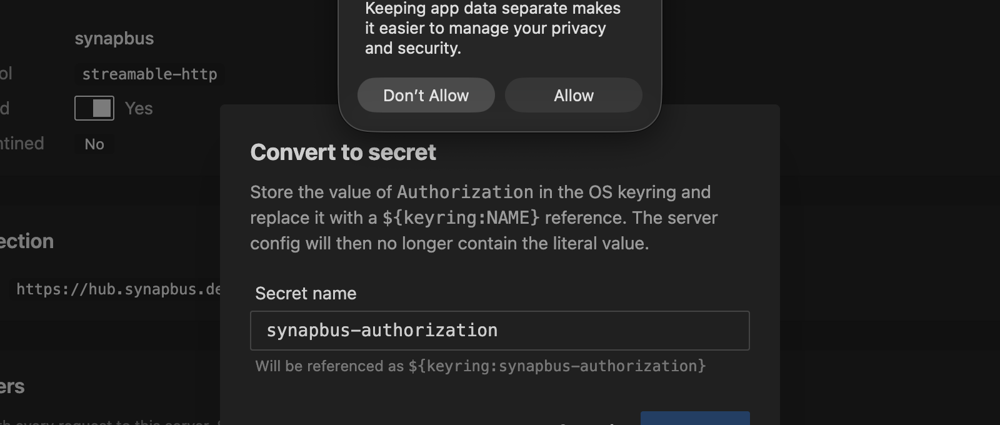

# Upstream Servers

MCPProxy can connect to multiple MCP servers simultaneously, providing unified access through a single endpoint.

## Server Types

MCPProxy supports three types of upstream connections:

### stdio Servers

Local servers that communicate via standard input/output:

```json
{
  "name": "filesystem",
  "command": "npx",
  "args": ["-y", "@modelcontextprotocol/server-filesystem", "/home/user/projects"],
  "protocol": "stdio",
  "enabled": true
}
```

### HTTP Servers

Remote servers accessible via HTTP/HTTPS:

```json
{
  "name": "remote-server",
  "url": "https://api.example.com/mcp",
  "protocol": "http",
  "enabled": true
}
```

### OAuth Servers

Servers requiring OAuth 2.1 authentication:

```json
{
  "name": "github-server",
  "url": "https://api.github.com/mcp",
  "protocol": "http",
  "oauth": {
    "client_id": "your-client-id",
    "scopes": ["repo", "user"]
  },
  "enabled": true
}
```

## Configuration Options

| Option | Type | Required | Description |
|--------|------|----------|-------------|
| `name` | string | Yes | Unique identifier for the server |
| `command` | string | For stdio | Command to execute |
| `args` | array | No | Command arguments |
| `url` | string | For HTTP | Server URL |
| `protocol` | string | Yes | `stdio` or `http` |
| `enabled` | boolean | No | Whether server is active (default: true) |
| `working_dir` | string | No | Working directory for stdio servers |
| `env` | object | No | Environment variables to pass |
| `oauth` | object | No | OAuth configuration |
| `health_check_interval` | duration | No | Per-server override for the liveness `ping` cadence (`0s` disables; falls back to the global value, then the `30s` default). No-op for Docker-isolated servers. |
| `tool_discovery_interval` | duration | No | Per-server override for the `tools/list` re-index sweep (`0s` disables; falls back to the global value, then the `5m` default). |

See [Tool Discovery & Health Check Intervals](/configuration/config-file#tool-discovery--health-check-intervals) for the global defaults, accepted ranges, and trade-offs.

## Headers, Environment Variables, and Secrets

Both HTTP `headers` and stdio `env` are first-class config fields you can
inspect and edit from the Web UI, the macOS tray, the CLI, and the REST
API. The wire format and semantics are identical across surfaces.

### How the API displays them

The REST API (`GET /api/v1/servers`), the SSE `servers.changed` event, and
the MCP `upstream_servers list` tool all redact sensitive header values
by default. The mask format is:

```
••••<last2> (<N> chars)
```

…e.g. a 71-character Bearer token whose last two characters are `59`
appears on the wire as `••••59 (71 chars)`. The mask preserves enough
context to identify which token is in use without leaking the secret.

Values that are already secret **references** — `${keyring:NAME}` or
`${env:VAR}` — pass through unchanged: they're labels, not secrets.

This redaction was added in PR #425 to close a real exfiltration path —
a prompt-injected agent calling `upstream_servers list` would otherwise
get back another upstream's Bearer token in plaintext.

To disable redaction (for debugging only), set `reveal_secret_headers: true`
in `mcp_config.json`. **It's not normally needed**: the editing flow
described below works without ever exposing the plaintext to the client.

### How you edit them

#### Web UI / macOS tray

The Server Detail page → Configuration tab has dedicated **Headers** and
**Environment Variables** cards with per-row affordances:


- **Add** — `+ Add header` / `+ Add variable` button at the top.
- **Edit** — pencil icon turns the value cell into an input. Save / Cancel.
- **Delete** — trash icon. Confirms first.
- **Convert to secret** — lock icon. Opens a modal asking for a name,
  then atomically moves the value into the OS keyring and replaces the
  config field with `${keyring:NAME}`.



The Convert flow works even on masked headers: the backend has the real
value in `mcp_config.json` and never needs the client to send it.

`${keyring:…}` references render as a labeled chip instead of a masked
literal, so converted headers are visually distinct.

#### CLI

```bash
# Upsert one or more headers
mcpproxy upstream patch synapbus --header "X-Trace: on"

# Rotate Authorization in place
mcpproxy upstream patch synapbus --header "Authorization: Bearer new-token"

# Delete one
mcpproxy upstream patch synapbus --header-remove "X-Stale"

# Mix set + delete in a single round-trip
mcpproxy upstream patch synapbus --header "X-New: v" --header-remove "X-Old"

# Env vars (stdio servers)
mcpproxy upstream patch obsidian-pilot --env "LOG_LEVEL=debug"
mcpproxy upstream patch obsidian-pilot --env-remove "OBSOLETE"
```

See [Management Commands](../cli/management-commands.md#patch-headers--env)
for the full flag reference.

#### REST API

`PATCH /api/v1/servers/{name}` follows JSON Merge Patch
([RFC 7396](https://www.rfc-editor.org/rfc/rfc7396)):

```bash
curl -X PATCH -H "X-API-Key: $KEY" -H "Content-Type: application/json" \
  -d '{"headers":{"X-New":"value","X-Stale":null}}' \
  http://127.0.0.1:8080/api/v1/servers/synapbus
```

- non-null string value → upsert
- JSON `null` value → delete
- key absent from body → preserve (this is how the UI sends a diff
  against the masked view without overwriting unchanged values)

See [REST API › PATCH](../api/rest-api.md#patch-apiv1serversname) for the
full reference, including the
[`/config-to-secret`](../api/rest-api.md#post-apiv1serversnameconfig-to-secret)
endpoint that backs the "Convert to secret" affordance.

### Secret references

`headers` and `env` values support two reference shapes that get resolved
at request time rather than stored in plaintext:

| Reference | Source | Lifetime |
|---|---|---|
| `${keyring:NAME}` | OS keyring entry called `NAME` | Persists across restarts; managed via the Secrets page or `mcpproxy secrets` CLI |
| `${env:VAR}` | The `VAR` environment variable on the mcpproxy process | Tied to the shell/launcher that started mcpproxy |

When mcpproxy connects to an upstream it substitutes the reference with
the actual secret. The reference itself never reaches the upstream MCP
server. See [Keyring Integration](../features/keyring-integration.md)
for the full secret-storage story.

## Docker Isolation

For enhanced security, stdio servers can run in Docker containers:

```json
{
  "name": "isolated-server",
  "command": "npx",
  "args": ["-y", "some-mcp-server"],
  "protocol": "stdio",
  "isolation": {
    "enabled": true,
    "image": "node:20",
    "network_mode": "bridge"
  }
}
```

**Note:** Memory and CPU limits are configured at the global level in `docker_isolation`, not per-server.

See [Docker Isolation](/features/docker-isolation) for complete documentation.

## Process Lifecycle

### Startup

When MCPProxy starts, it:
1. Loads server configurations from `mcp_config.json`
2. Creates MCP clients for each enabled, non-quarantined server
3. Connects to servers in the background (async)
4. Indexes tools once connections are established

### Shutdown

When MCPProxy stops, it performs graceful shutdown of all subprocesses:

1. **Graceful Close** (10s): Close MCP connection, wait for process to exit
2. **Force Kill** (9s): If still running, SIGTERM → poll → SIGKILL

**Process groups**: Child processes (spawned by npm/npx/uvx) are placed in a process group, ensuring all related processes are terminated together.

See [Shutdown Behavior](/operations/shutdown-behavior) for detailed documentation.

## Quarantine System

New servers added via AI clients are automatically quarantined for security review. See [Security Quarantine](/features/security-quarantine) for details.
